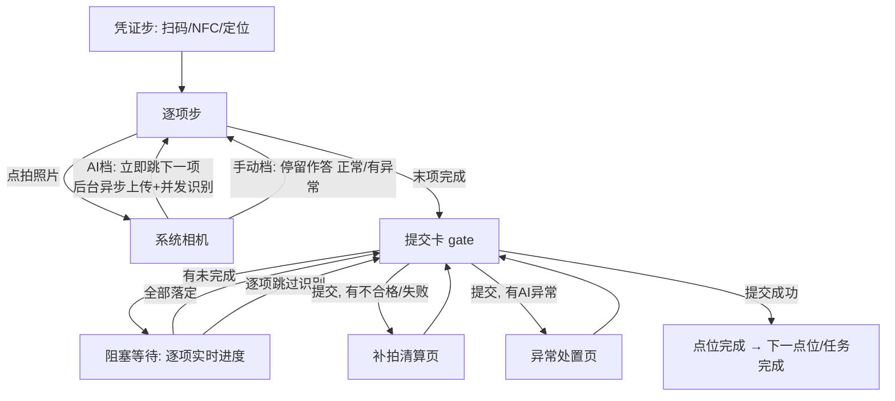

# 打卡向导交互重构设计方案（App + 后端 AI 并发）

> 版本：v2.1（评审稿，取代 v2.0）
> 范围：App 打卡向导全链路（`quick.vue` 及子组件）+ 后端 AI 识别并发化；连续巡检（AI 档）与手动巡检（手动档）共用骨架
> 约束：不改接口字段语义；不引入 UI 组件库

---

## 一、第一约束与核心体验目标

**用户是不会操作手机的人，但人人会微信。** 所有交互向微信肌肉记忆对齐：

- **可点的东西必须长得像按钮**：实心填充 + 文字说明，大得不可能错过。禁止纯图标当主操作、禁止虚线框当按钮（甲方实测：卡片中间画个相机图标，巡检员以为是张图片，找了半天不知道在哪拍照）。
- **主操作永远在屏幕最底部**，微信式通栏实心大按钮；双按钮并排均分。
- **可进入的行用微信列表行**（左文右 ›）；**弹层从底部滑出**（微信 ActionSheet 形态）；**返回键永远=退出**，不叠加第二套退出入口。

**核心体验目标：逐项零阻塞。** 巡检员的感知 = **拍一张，立刻可以拍下一张**。上传、AI 识别全部后台异步，逐项流程中不做任何等待；所有等待集中到点位提交一处——没识别完的在那里阻塞，落定才放行。

## 二、屏幕骨架（三段式，全阶段统一）

```
┌─────────────────────────────┐
│ ‹  手动巡检/连续巡检      [?]│  ← ⓪ 蓝色导航条：返回=退出；
│                             │     右侧问号=逃生（仅逐项步）
├─────────────────────────────┤
│ ① 顶部：点位进度卡            │
│   点位 5/36    第 1/3 项     │
├─────────────────────────────┤
│ ② 内容：当前卡片              │
│   （逐项卡 / 提交卡 / 清单页） │
├─────────────────────────────┤
│ ③ 底部操作栏（fixed）         │
│ ┌─────────────────────────┐ │
│ │   主操作区（通栏居中）     │ │  ← 1~2 个按钮，随状态机切换
│ └─────────────────────────┘ │
│         ‹ 上一项             │  ← 灰字，主按钮正下方居中，
└─────────────────────────────┘     位置永远不变
```

- **凭证步不显示底部操作栏**；「‹ 上一项」从逐项步开始出现，逐项第 1 项时回到凭证步。
- 逃生「?」仅逐项步显示（台账项所在步不显示）；微信小程序端需避让官方胶囊（当前只发 App，仅备注不做）。

## 三、逐项卡片统一布局

```
┌─────────────────────────────┐
│ 引导语（大字号 2~3 行）      │
│ 检查项名（小字灰）            │
│ ┌─────────────────────────┐ │
│ │      照片槽 PhotoSlot    │ │
│ └─────────────────────────┘ │
│ 〔状态条 ResultBar〕          │  ← 无状态时整行不占位
│ 观察点（6）  全部正常 ✓    › │  ← 下拉多选入口行，无 tag 不渲染
│ 〔类型差异区〕                │  ← 台账行/抽查读数行，无则不渲染
└─────────────────────────────┘
```

| 类型 | 照片槽 | 观察点行 | 差异区 |
|---|---|---|---|
| 拍照项（AI 档/手动档） | 必有（必拍/选拍） | 有 tag 则有 | 无 |
| 感官项 | 选拍 | 有 tag 则有 | 无 |
| 台账有效期项 | 无（逾期时变为"拍新标签"槽，多图至多 3） | 无 | 一行台账状态小字 |
| 标签抽查项 | 必拍 1 | 无 | AI 读数一行小字 |

## 四、拍照链路：拍完即走，一切异步

### 4.1 逐项流程（两档一致）

```
点「📷 拍照片」→ 系统相机 → 确认照片 → 立即自动进入下一项
```

- **不等上传、不等识别**：照片先以本地路径进槽位，后台队列依次完成 压缩→上传→（AI 档）建 job→并发识别→轮询落定。
- 巡检员正向一路拍到底，中间没有任何 loading、遮罩、等待条。
- 弱网/离线：照片进本地待传队列，不阻塞拍摄；联网自动补传。

### 4.2 手动档的差异

拍完照同样立即下一项，但**结论（正常/异常）必须当下作答**——手动档没有 AI 兜底，所以手动档拍完不自动跳，停留等点「✓ 正常 / ⚠ 有异常」后再下一项。两档差异仅这一句。

### 4.3 照片槽 PhotoSlot（六态）

| 态 | 视觉 | 点按行为 |
|---|---|---|
| 空·必拍 | 灰底占位区 + 灰字"还没有照片"（**不可点**） | 拍照只走底部大按钮「📷 拍照片」 |
| 空·选拍 | 不渲染占位区，改为列表行"📷 随手拍一张（可选） ›" | 点行=调相机 |
| 后台处理中 | 本地实拍图 + 右上角小型状态点（灰转圈） | 点图=预览；不阻塞任何操作 |
| 已拍 | 16:9 大图；照片下方通栏描边按钮「重新拍照」 | 点图=预览；「重新拍照」=重拍（替换） |
| 待补传 | 大图 + 橙色状态条"照片还没传上去，联网自动补传" | 可点条=立即重试 |
| 已逃生 | 灰占位 + 异常类型文字 | 点导航条「?」改报/撤销 |

**一图一位**：重拍=替换（旧 file_id 作废），无"补拍第 2 张"；例外仅台账新标签与处置佐证（多图槽，至多 3 张）。

**纯图标禁令落地**：空态虚线框相机图标、照片角标「⟳」全部废除；拍照/重拍/补传入口全是带文字的按钮或列表行。

### 4.4 状态条 ResultBar（回退查看时的只读展示）

AI 档逐项**正向不展示识别等待**（拍完已跳走）。巡检员用「‹ 上一项」回退查看时，状态条如实呈现后台进度：

| 后台状态 | 状态条 |
|---|---|
| 排队/上传中 | 灰条："照片处理中…" |
| 识别中 | 蓝条："AI 识别中…"（不计时、不催促） |
| 判正常 | 绿条："✓ AI 检查正常" |
| 判异常 | 橙条："⚠ AI 发现异常：{理由≤30字}"，观察点预选红芯片可改 |
| 质量不合格 | 红条："照片不合格：{原因}" + 「重新拍照」按钮 |
| 失败/超时 | 红条："识别失败" + 「重新拍照」「跳过识别」 |

**没有任何状态会拦住巡检员**——不合格/失败也不当下拦（人可能已离开设备），统一在点位提交时清算（见第六节）。

## 五、底部操作栏：状态-按钮对照表（唯一真相）

主操作区通栏居中（凭证步不显示操作栏），「‹ 上一项」是主按钮正下方的居中灰字：

| 阶段 | 状态 | 主操作区 | 备注 |
|---|---|---|---|
| 逐项 | 必拍未拍 | [📷 拍照片] | 实心蓝底通栏大按钮，唯一拍照入口 |
| 逐项 | 选拍/免拍未拍 | [✓ 正常] [⚠ 有异常] | 拍照走卡内列表行 |
| 逐项 | 手动档已拍 | [✓ 正常] [⚠ 有异常] | 作答后下一项 |
| 逐项 | AI 档已拍 | — | **拍完自动跳走，无此停留态**；回退查看时主操作区为 [下一项 ›] |
| 逐项 | 台账/抽查项就绪 | [下一项 ›] | |
| 逐项 | 逃生已上报 | [下一项 ›] | |
| 提交卡 gate | 全部落定 | [提交本点位] | |
| 提交卡 gate | 后台未完成 | [等待处理 剩 N 项]（置灰）+ 卡内逐项进度 | 见第六节 |
| 补拍清算 | — | [重新提交本点位] | |
| 异常处置 | — | [确认，去下一处] | |

「⚠ 有异常」= 底部半屏（观察点多选+备注+确认），确认后自动下一项——不再有内联展开。

## 六、点位提交：唯一的等待点

gate 提交卡是全流程**唯一会阻塞**的地方：

```
┌──────────────────────────────┐
│ 本点位 4 项                   │
│ ✓已落定2  ⏳处理中2  ⚠异常0   │
│ ⏳ 灭火器整体检查   识别中…    │
│ ⏳ 消火栓箱整体检查  上传中…   │
├──────────────────────────────┤
│ │  等待处理（还剩 2 项）      │ │ ← 置灰
│         ‹ 上一项              │
└──────────────────────────────┘
```

- 每项一行实时状态（上传中/排队中/识别中），落定一行勾掉一行；全部落定按钮自动亮起「提交本点位」。
- 给「跳过识别 ›」逐项入口（转人工复核），不让巡检员死等。
- 有不合格/失败项 → 提交后（或点击后）进补拍清算页：清单卡片逐项 [重新拍照]/[跳过识别]，处理完「重新提交本点位」。
- 有 AI 判异常项 → 异常处置页（上报待处理/现场已处理+处置照片），视觉同清单页。

## 七、后端：AI 并发识别队列

现状风险：识别若串行/受连接池阻塞，连续拍照时 job 排队时间过长，gate 阻塞时间会很长。改造：

1. **job 创建即入内存队列**，N 路并发 worker（可配，默认 8）同时调大模型；来了任务立即开识别，不排队等前一个点位。
2. 并发数、单任务超时（180s）走 `system_configs`，与现有 `ai.disable_thinking` 同级。
3. 队列只保活 job 调度；job 状态仍落库，App 轮询协议不变（前端零改动）。
4. 大模型侧若限流（429），worker 指数退避重试，超限转"识别失败"态（前端逃生口径已有）。

## 八、逃生「?」、观察点、有异常半屏（沿用 v2.0 口径）

- 逃生：导航条右侧「?」→ ActionSheet 选类型（设备不存在/无法拍摄/标签磨损仅抽查项）→ 拍佐证 → 灰占位"已逃生"。
- 观察点：一行「全部正常 ✓ ›」→ 底部半屏 checklist 勾选异常 → 红芯片回显；数据走 `abnormal_tags`。
- 有异常：底部半屏（观察点+备注+确认），确认自动下一项。

## 九、全局状态机



## 十、关键线框图

### 屏 1：必拍项 · 未拍

```
┌──────────────────────────┐
│ ←  连续巡检           (?) │
│ 点位 5/36     第 1/3 项   │
├──────────────────────────┤
│ 拍消火栓箱整体照片，       │
│ 打开箱门让水带枪头入画     │
│ ┌──────────────────────┐ │
│ │   （灰底占位，不可点）   │ │
│ │     还没有照片          │ │
│ └──────────────────────┘ │
│ 观察点(6)  全部正常 ✓   › │
├──────────────────────────┤
│ │      📷 拍照片        │ │  ← 实心蓝底通栏大按钮
│         ‹ 上一项          │
└──────────────────────────┘
拍完瞬间自动跳到第 2 项——无等待
```

### 屏 2：回退查看 · 后台识别中

```
│ ┌──────────────────────┐ │
│ │     [实拍照片]        │ │
│ └──────────────────────┘ │
│ ⏳ AI 识别中…             │  ← 只读状态条
├──────────────────────────┤
│ │       下一项 ›        │ │
│         ‹ 上一项          │
└──────────────────────────┘
```

### 屏 3：手动档 · 已拍待作答

```
│ ┌──────────────────────┐ │
│ │     [实拍照片]        │ │
│ └──────────────────────┘ │
│ [       重新拍照       ]  │
│ 观察点(6)  全部正常 ✓   › │
├──────────────────────────┤
│ │  ✓ 正常  ││ ⚠ 有异常 │ │
│         ‹ 上一项          │
└──────────────────────────┘
```

### 屏 4：gate 阻塞 → 见第六节

## 十一、组件与实施

| 组件 | 动作 | 职责 |
|---|---|---|
| `quick.vue` | 重构 | phase 状态机 + **后台任务队列**（上传/建job/轮询全部离主流程）+ 草稿 |
| `WizardBottomBar.vue` | 新增 | 通栏居中主操作区 + 正下方居中「‹ 上一项」，状态-按钮真相表 |
| `WizardPhotoSlot.vue` | 新增 | 六态单图槽 + 多图变体 |
| `WizardResultBar.vue` | 新增 | 只读状态条（回退查看用） |
| `QuickTagPicker.vue` | 新增 | 观察点多选半屏 |
| `QuickItemCard.vue` | 重构 | 组合以上，自身无按钮 |
| `QuickGateCard.vue` | 重构 | 逐项实时进度 + 置灰等待 + 逐项跳过 |
| `QuickIssuePanel.vue` | 重构 | 清单页样式，去红横幅 |
| 后端 `ai_item_job` | 改造 | 内存队列 + 并发 worker（可配，默认 8）+ 限流退避 |

实施分期：

| 期 | 内容 |
|---|---|
| P0 | 拍照异步化（拍完即走）+ 有异常半屏 + 照片常驻 + 逃生「?」 |
| P1 | 三段式骨架 + WizardBottomBar + PhotoSlot |
| P2 | gate 逐项实时进度阻塞 + 清算页统一 + 后端并发队列 |
| P3 | 观察点多选 + ResultBar 只读态 + 死代码清理 |

## 十二、不做的事

- 逐项流程中不做任何 AI/上传等待（唯一的等待在 gate）。
- 不改 AI job 轮询协议与字段；不恢复一页式表单；不引入组件库。

---

## 十三、凭证步无感化改造（评估稿，待评审）

目标：到场即自动核验，三种凭证零点击或近零点击；**核验齐全自动进入第一项，取消「开始检查」按钮**——凭证步只是一个短暂的核验状态页，不是一道门。核验未齐时停在凭证步，缺哪项哪行红字说明+点行重试。

### 13.1 NFC 贴卡即识别（可行，半数已有）

- 现状：`app/utils/nfc.ts` 的 `startGlobalListener` 已实现 Android/鸿蒙前台全局监听，贴卡即触发任务定位器**跳页**进向导。
- 改造：向导内（凭证步）注册 dispatch 接管——贴卡 UID 命中当前点位 → 直接点亮 NFC ✓，不跳页；不命中 → toast"这不是本点位的卡"。离开向导归还全局路由。
- iOS 不行（CoreNFC 强制用户触发），保留按钮；当前只发 Android，无影响。

### 13.2 定位自动获取（可行，纯前端）

- 进凭证步自动获取一次，行内显示"📍 距点位 35 米（围栏 50 米内 ✓）/ 超出围栏（当前 120 米）"。
- 不做实时刷新（GPS 跳变会造成恐慌）；失败自动重试一次，仍失败给"点我重试"。

### 13.3 内嵌摄像头扫码（可行，5+ API）

- 不用 `<camera>` 组件（无扫码识别能力）；用 `plus.barcode` 在凭证卡中部开固定高度原生扫码视图，持续识别，扫到即震动+点亮+自动关闭。
- 约束：原生视图盖在 webview 上层不随滚动——凭证步内容短不滚动，正好成立；离开凭证步必须 close（生命周期收进 phase 状态机）。
- 附带收益：持续取景 = 人必须在现场，天然防代扫。
- 全屏 `uni.scanCode` 保留为备用入口（扫码窗故障时）。

### 13.4 凭证类型 × 界面组合（四种，含 NFC+扫码同屏）

点位凭证配置四种：`qrcode` / `nfc` / `any`（任一即可）/ 无；围栏 `require_fence` 是独立开关，可叠加在任意一种上。

| 配置 | 界面元素 | 完成判定 |
|---|---|---|
| 无凭证 | 一行"✓ 本点位到场直接检查" | 无需操作 |
| `qrcode` | 内嵌扫码取景窗 | 扫到即 ✓ |
| `nfc` | NFC 行"贴卡自动识别…"（Android 常驻监听） | 贴卡命中即 ✓ |
| `any`（同屏） | **扫码窗在上 + NFC 行在下**，中间一行灰字"两种方式，任选其一" | 任一完成即 ✓ |

`any` 同屏规则（重点）：

- **谁先完成谁生效**：扫到码 → 扫码窗立即关闭收起，标题下出现绿行"✓ 已通过二维码核验"；NFC 行同时变灰隐藏（不再需要）。
- 贴卡命中同理：NFC 行点亮"✓ 已通过 NFC 核验"，扫码窗关闭收起。
- 两种都未完成前，两个入口都活着，互不阻塞。
- 不允许"两个都验"——任一完成即锁死，避免重复凭证语义（后端 `checkin_type` 也只记一种）。
- **手动档入口在凭证步**：凭证卡底部一行灰字"AI 不好使？改用人工填写 ›"（仅凭证步显示；任务详情页/附近点位的点位级「手动填写」入口保留）。档位在进门时定，逐项步中途不提供切换。

```
any 未完成态：                     any 扫码完成后：
┌──────────────────────────┐      ┌──────────────────────────┐
│ 到场打卡                  │      │ 到场打卡                  │
│ ┌──────────────────────┐ │      │ ✓ 已通过二维码核验         │
│ │   [内嵌扫码取景窗]     │ │      │ 📍 距点位 35 米（围栏内 ✓）│
│ └──────────────────────┘ │      └──────────────────────────┘
│ 两种方式，任选其一         │        "✓ 核验通过"绿色一闪（0.6s）
│ NFC   贴卡自动识别 …      │        → 自动进入第 1 项
│ 📍 距点位 35 米（围栏内 ✓）│
└──────────────────────────┘
  核验未齐：停在本状态，缺哪项红字提示，无按钮
```

工作量评估：NFC 接管（小）+ 定位自动（小）+ plus.barcode 内嵌（中，主要是生命周期与层级）。建议排在 P2 之后单独立项 P4。
