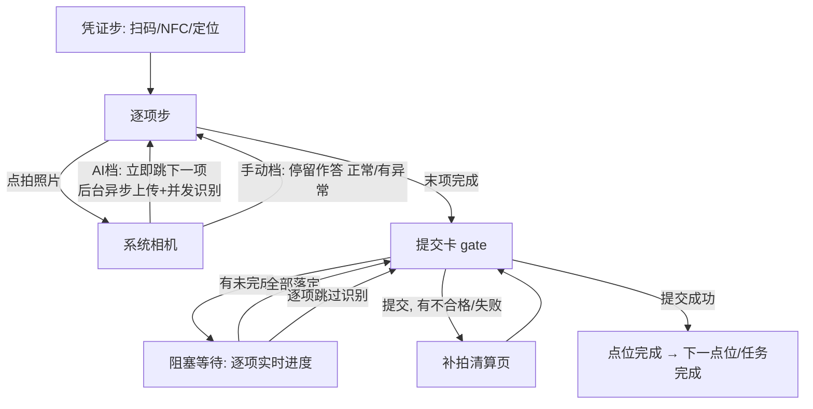

# 打卡向导交互重构设计方案（App + 后端 AI 并发）

> 版本：v2.1（评审稿，取代 v2.0）
> 范围：App 打卡向导全链路（`quick.vue` 及子组件）+ 后端 AI 识别并发化；连续巡检（AI 档）与手动巡检（手动档）共用骨架
> 约束：不改接口字段语义；不引入 UI 组件库

---

## 一、第一约束与核心体验目标

**用户是不会操作手机的人，但人人会微信。** 所有交互向微信肌肉记忆对齐：

- **可点的东西必须长得像按钮**：实心填充 + 文字说明，大得不可能错过。禁止纯图标当主操作、禁止虚线框当按钮（甲方实测：卡片中间画个相机图标，巡检员以为是张图片，找了半天不知道在哪拍照）。
- **主操作永远在屏幕底部操作栏**，微信式通栏实心大按钮；双按钮并排均分。**操作栏在文档流底部、随整页一起滚动，不做 fixed 固定**（实测固定栏+内容滚动很别扭）。
- **可进入的行用微信列表行**（左文右 ›）；**弹层从底部滑出**（微信 ActionSheet 形态）；**返回键永远=退出**，不叠加第二套退出入口。

**核心体验目标：逐项零阻塞。** 巡检员的感知 = **拍一张，立刻可以拍下一张**。上传、AI 识别全部后台异步，逐项流程中不做任何等待；所有等待集中到点位提交一处——没识别完的在那里阻塞，落定才放行。

## 二、屏幕骨架（三段式，全阶段统一）

```
┌─────────────────────────────┐
│ ‹  手动巡检/连续巡检      [?]│  ← ⓪ 蓝色导航条：返回=退出；
│                             │     右侧问号=逃生（仅逐项步）
├─────────────────────────────┤
│ ① 顶部：点位进度卡            │
│   点位 5/36    第 1/3 项     │
├─────────────────────────────┤
│ ② 内容：当前卡片              │
│   （逐项卡 / 提交卡 / 清单页） │
├─────────────────────────────┤
│ ③ 底部操作栏（文档流底部）    │
│ ┌─────────────────────────┐ │
│ │   主操作区（通栏居中）     │ │  ← 1~2 个按钮，随状态机切换
│ └─────────────────────────┘ │
│         ‹ 上一项             │  ← 灰字，主按钮正下方居中，
└─────────────────────────────┘     位置永远不变
```

- **凭证步不显示底部操作栏**；「‹ 上一项」从逐项步开始出现，逐项第 1 项时回到凭证步。
- 逃生「?」仅逐项步显示（台账项所在步不显示）；微信小程序端需避让官方胶囊（当前只发 App，仅备注不做）。

## 三、逐项卡片统一布局

```
┌─────────────────────────────┐
│ 引导语（大字号 2~3 行）      │
│ 检查项名（小字灰）            │
│ ┌─────────────────────────┐ │
│ │      照片槽 PhotoSlot    │ │
│ └─────────────────────────┘ │
│ 〔状态条 ResultBar〕          │  ← 无状态时整行不占位
│ 观察点（6）  全部正常 ✓    › │  ← 下拉多选入口行，无 tag 不渲染
│ 〔类型差异区〕                │  ← 台账行/抽查读数行，无则不渲染
└─────────────────────────────┘
```

| 类型 | 照片槽 | 观察点行 | 差异区 |
|---|---|---|---|
| 拍照项（AI 档/手动档） | 必有（必拍/选拍） | 有 tag 则有 | 无 |
| 感官项 | 选拍 | 有 tag 则有 | 无 |
| 台账有效期项 | 无（逾期时变为"拍新标签"槽，多图至多 3） | 无 | 一行台账状态小字 |
| 标签抽查项 | 必拍 1 | 无 | AI 读数一行小字 |

## 四、拍照链路：拍完即走，一切异步

### 4.1 逐项流程（两档一致）

```
点「📷 拍照片」→ 系统相机 → 确认照片 → 立即自动进入下一项
```

- **不等上传、不等识别**：照片先以本地路径进槽位，后台队列依次完成 压缩→上传→（AI 档）建 job→并发识别→轮询落定。
- 巡检员正向一路拍到底，中间没有任何 loading、遮罩、等待条。
- 弱网/离线：照片进本地待传队列，不阻塞拍摄；联网自动补传。

### 4.2 手动档的差异

拍完照同样立即下一项，但**结论（正常/异常）必须当下作答**——手动档没有 AI 兜底，所以手动档拍完不自动跳，停留等点「✓ 正常 / ⚠ 有异常」后再下一项。两档差异仅这一句。

### 4.3 照片槽 PhotoSlot（六态）

| 态 | 视觉 | 点按行为 |
|---|---|---|
| 空·必拍 | 灰底占位区 + 灰字"还没有照片"（**不可点**） | 拍照只走底部大按钮「📷 拍照片」 |
| 空·选拍 | 不渲染占位区，改为列表行"📷 随手拍一张（可选） ›" | 点行=调相机 |
| 后台处理中 | 本地实拍图 + 右上角小型状态点（灰转圈） | 点图=预览；不阻塞任何操作 |
| 已拍 | 16:9 大图；照片下方通栏描边按钮「重新拍照」 | 点图=预览；「重新拍照」=重拍（替换） |
| 待补传 | 大图 + 橙色状态条"照片还没传上去，联网自动补传" | 可点条=立即重试 |
| 已逃生 | 灰占位 + 异常类型文字 | 点导航条「?」改报/撤销 |

**一图一位**：重拍=替换（旧 file_id 作废），无"补拍第 2 张"；唯一例外是台账新标签（多图槽，至多 3 张）。

**纯图标禁令落地**：空态虚线框相机图标、照片角标「⟳」全部废除；拍照/重拍/补传入口全是带文字的按钮或列表行。

### 4.4 状态条 ResultBar（回退查看时的只读展示，无任何按钮）

按钮去重规则（实测修掉的重复）：重拍唯一入口=照片槽「重新拍照」；跳过识别=底栏次级按钮（失败态）与清算页；ResultBar 只出文案不出按钮。

AI 档逐项**正向不展示识别等待**（拍完已跳走）。巡检员用「‹ 上一项」回退查看时，状态条如实呈现后台进度：

| 后台状态 | 状态条 |
|---|---|
| 排队/上传中 | 灰条："照片处理中…" |
| 识别中 | 蓝条："AI 识别中…"（不计时、不催促） |
| 判正常 | 绿条："✓ AI 检查正常" |
| 判异常 | 橙条："⚠ AI 发现异常：{理由≤30字}"，观察点预选红芯片可改 |
| 质量不合格 | 红条："照片不合格：{原因}"（重拍走照片槽按钮） |
| 失败/超时 | 红条："识别失败"（底栏给「跳过识别」，重拍走照片槽按钮） |

**没有任何状态会拦住巡检员**——不合格/失败也不当下拦（人可能已离开设备），统一在点位提交时清算（见第六节）。

## 五、底部操作栏：状态-按钮对照表（唯一真相）

主操作区通栏居中（凭证步不显示操作栏），「‹ 上一项」是主按钮正下方的居中灰字：

| 阶段 | 状态 | 主操作区 | 备注 |
|---|---|---|---|
| 逐项 | 必拍未拍 | [📷 拍照片] | 实心蓝底通栏大按钮，唯一拍照入口 |
| 逐项 | 选拍/免拍未拍 | [✓ 正常] [⚠ 有异常] | 拍照走卡内列表行 |
| 逐项 | 手动档已拍 | [✓ 正常] [⚠ 有异常] | 作答后下一项 |
| 逐项 | AI 档已拍 | — | **拍完自动跳走，无此停留态**；回退查看时主操作区为 [下一项 ›] |
| 逐项 | 台账/抽查项就绪 | [下一项 ›] | |
| 逐项 | 逃生已上报 | [下一项 ›] | |
| 提交卡 gate | 全部落定 | [提交本点位] | |
| 提交卡 gate | 后台未完成 | [等待处理 剩 N 项]（置灰）+ 卡内逐项进度 | 见第六节 |
| 补拍清算 | — | [重新提交本点位] | |

「⚠ 有异常」= 底部半屏（观察点多选+备注+确认），确认后自动下一项——不再有内联展开。

## 六、点位提交：唯一的等待点

gate 提交卡是全流程**唯一会阻塞**的地方：

```
┌──────────────────────────────┐
│ 本点位 4 项                   │
│ ✓已落定2  ⏳处理中2  ⚠异常0   │
│ ⏳ 灭火器整体检查   识别中…    │
│ ⏳ 消火栓箱整体检查  上传中…   │
├──────────────────────────────┤
│ │  等待处理（还剩 2 项）      │ │ ← 置灰
│         ‹ 上一项              │
└──────────────────────────────┘
```

- 每项一行实时状态（上传中/排队中/识别中），落定一行勾掉一行；全部落定按钮自动亮起「提交本点位」。
- **自动提交只在会话内顺向推进到 gate 时武装**（`gateArmed`）：断点恢复/切档重进停在 gate 不自动提交，等用户点按钮——恢复现场不产生任何副作用。
- 给「跳过识别 ›」逐项入口（转人工复核），不让巡检员死等。
- 有不合格/失败项 → 提交后（或点击后）进补拍清算页：清单卡片逐项 [重新拍照]/[跳过识别]，处理完「重新提交本点位」。
- 有异常项（AI 判异常/手动答异常/逃生）→ 不单独设页，随点位直接提交；服务端见异常即强制人工审核。

## 七、后端：AI 并发识别队列

现状风险：识别若串行/受连接池阻塞，连续拍照时 job 排队时间过长，gate 阻塞时间会很长。改造：

1. **job 创建即入内存队列**，N 路并发 worker（可配，默认 8）同时调大模型；来了任务立即开识别，不排队等前一个点位。
2. 并发数、单任务超时（180s）走 `system_configs`，与现有 `ai.disable_thinking` 同级。
3. 队列只保活 job 调度；job 状态仍落库，App 轮询协议不变（前端零改动）。
4. 大模型侧若限流（429），worker 指数退避重试，超限转"识别失败"态（前端逃生口径已有）。

## 八、逃生「?」、观察点、有异常半屏（沿用 v2.0 口径）

- 逃生：导航条右侧「?」→ ActionSheet 选类型（设备不存在/无法拍摄/标签磨损仅抽查项）→ 拍佐证 → 灰占位"已逃生"。
- 观察点：一行「全部正常 ✓ ›」→ 底部半屏 checklist 勾选异常 → 红芯片回显；数据走 `abnormal_tags`。
- 有异常：底部半屏（观察点+备注+确认），确认自动下一项。

## 九、全局状态机



## 十、关键线框图

### 屏 1：必拍项 · 未拍

```
┌──────────────────────────┐
│ ←  连续巡检           (?) │
│ 点位 5/36     第 1/3 项   │
├──────────────────────────┤
│ 拍消火栓箱整体照片，       │
│ 打开箱门让水带枪头入画     │
│ ┌──────────────────────┐ │
│ │   （灰底占位，不可点）   │ │
│ │     还没有照片          │ │
│ └──────────────────────┘ │
│ 观察点(6)  全部正常 ✓   › │
├──────────────────────────┤
│ │      📷 拍照片        │ │  ← 实心蓝底通栏大按钮
│         ‹ 上一项          │
└──────────────────────────┘
拍完瞬间自动跳到第 2 项——无等待
```

### 屏 2：回退查看 · 后台识别中

```
│ ┌──────────────────────┐ │
│ │     [实拍照片]        │ │
│ └──────────────────────┘ │
│ ⏳ AI 识别中…             │  ← 只读状态条
├──────────────────────────┤
│ │       下一项 ›        │ │
│         ‹ 上一项          │
└──────────────────────────┘
```

### 屏 3：手动档 · 已拍待作答

```
│ ┌──────────────────────┐ │
│ │     [实拍照片]        │ │
│ └──────────────────────┘ │
│ [       重新拍照       ]  │
│ 观察点(6)  全部正常 ✓   › │
├──────────────────────────┤
│ │  ✓ 正常  ││ ⚠ 有异常 │ │
│         ‹ 上一项          │
└──────────────────────────┘
```

### 屏 4：gate 阻塞 → 见第六节

## 十一、组件与实施

| 组件 | 动作 | 职责 |
|---|---|---|
| `quick.vue` | 重构 | phase 状态机 + **后台任务队列**（上传/建job/轮询全部离主流程）+ 草稿 |
| `WizardBottomBar.vue` | 新增 | 通栏居中主操作区 + 正下方居中「‹ 上一项」，状态-按钮真相表 |
| `WizardPhotoSlot.vue` | 新增 | 六态单图槽 + 多图变体 |
| `WizardResultBar.vue` | 新增 | 只读状态条（回退查看用） |
| `QuickTagPicker.vue` | 新增 | 观察点多选半屏 |
| `QuickItemCard.vue` | 重构 | 组合以上，自身无按钮 |
| `QuickGateCard.vue` | 重构 | 逐项实时进度 + 置灰等待 + 逐项跳过 |
| `QuickIssuePanel.vue` | 重构 | 清单页样式，去红横幅 |
| 后端 `ai_item_job` | 改造 | 内存队列 + 并发 worker（可配，默认 8）+ 限流退避 |

实施分期：

| 期 | 内容 |
|---|---|
| P0 | 拍照异步化（拍完即走）+ 有异常半屏 + 照片常驻 + 逃生「?」 |
| P1 | 三段式骨架 + WizardBottomBar + PhotoSlot |
| P2 | gate 逐项实时进度阻塞 + 清算页统一 + 后端并发队列 |
| P3 | 观察点多选 + ResultBar 只读态 + 死代码清理 |

## 十二、不做的事

- 逐项流程中不做任何 AI/上传等待（唯一的等待在 gate）。
- 不改 AI job 轮询协议与字段；不恢复一页式表单；不引入组件库。

---

## 十三、凭证步无感化改造（评估稿，待评审）

目标：到场即自动核验，三种凭证零点击或近零点击；**核验齐全自动进入第一项，取消「开始检查」按钮**——凭证步只是一个短暂的核验状态页，不是一道门。核验未齐时停在凭证步，缺哪项哪行红字说明+点行重试。

### 13.1 NFC 贴卡即识别（可行，半数已有）

- 现状：`app/utils/nfc.ts` 的 `startGlobalListener` 已实现 Android/鸿蒙前台全局监听，贴卡即触发任务定位器**跳页**进向导。
- 改造：向导内（凭证步）注册 dispatch 接管——贴卡 UID 命中当前点位 → 直接点亮 NFC ✓，不跳页；不命中 → toast"这不是本点位的卡"。离开向导归还全局路由。
- iOS 不行（CoreNFC 强制用户触发），保留按钮；当前只发 Android，无影响。

### 13.2 定位自动获取（可行，纯前端）

- 进凭证步自动获取一次，行内显示"📍 距点位 35 米（围栏 50 米内 ✓）/ 超出围栏（当前 120 米）"。
- 不做实时刷新（GPS 跳变会造成恐慌）；失败自动重试一次，仍失败给"点我重试"。

### 13.3 扫码核验：点击拉起全屏扫码（内嵌方案已废弃）

- ~~plus.barcode 内嵌扫码窗~~：官方 `<camera>` 组件不支持 App 端（甲方查阅文档拍板），内嵌原生视图方案废弃，扫码行恢复为"点我扫码 ›"拉起全屏 `uni.scanCode`——交互更简单、各端一致。
- 围栏自动获取、NFC 常驻监听、核验齐全自动进入不变。

### 13.4 凭证类型 × 界面组合（四种，含 NFC+扫码同屏）

点位凭证配置四种：`qrcode` / `nfc` / `any`（任一即可）/ 无；围栏 `require_fence` 是独立开关，可叠加在任意一种上。

| 配置 | 界面元素 | 完成判定 |
|---|---|---|
| 无凭证 | 一行"✓ 本点位到场直接检查" | 无需操作 |
| `qrcode` | 内嵌扫码取景窗 | 扫到即 ✓ |
| `nfc` | NFC 行"贴卡自动识别…"（Android 常驻监听） | 贴卡命中即 ✓ |
| `any`（同屏） | **扫码窗在上 + NFC 行在下**，中间一行灰字"两种方式，任选其一" | 任一完成即 ✓ |

注：当前没有"扫码+NFC 双核验"模式。若甲方要求双验（防代打卡更严），需新增第四种 `both` 类型（后端字段 + PC 配置 + 向导两个都 ✓ 才自动放行），单独立项。

`any` 同屏规则（重点）：

- **谁先完成谁生效**：扫到码 → 扫码窗立即关闭收起，标题下出现绿行"✓ 已通过二维码核验"；NFC 行同时变灰隐藏（不再需要）。
- 贴卡命中同理：NFC 行点亮"✓ 已通过 NFC 核验"，扫码窗关闭收起。
- 两种都未完成前，两个入口都活着，互不阻塞。
- 不允许"两个都验"——任一完成即锁死，避免重复凭证语义（后端 `checkin_type` 也只记一种）。
- **手动档入口两处**：凭证卡底部灰字行"AI 不好使？改用人工填写 ›"（凭证步）；**逐项步底栏「‹ 上一项」下方再加一行居中灰字**（NFC/扫码预核验自动进场时凭证步一闪而过，入口必须在逐项步才点得到）。**切换是双向的**：AI 档显示"AI 不好使？改用人工填写"，手动档显示"改回 AI 自动识别"——草稿在云端，互切不丢进度，已核验凭证随 `no` 参数带过免核验。任务详情页/附近点位的点位级「手动填写」入口保留。

```
any 未完成态：                     any 扫码完成后：
┌──────────────────────────┐      ┌──────────────────────────┐
│ 到场打卡                  │      │ 到场打卡                  │
│ ┌──────────────────────┐ │      │ ✓ 已通过二维码核验         │
│ │   [内嵌扫码取景窗]     │ │      │ 📍 距点位 35 米（围栏内 ✓）│
│ └──────────────────────┘ │      └──────────────────────────┘
│ 两种方式，任选其一         │        "✓ 核验通过"绿色一闪（0.6s）
│ NFC   贴卡自动识别 …      │        → 自动进入第 1 项
│ 📍 距点位 35 米（围栏内 ✓）│
└──────────────────────────┘
  核验未齐：停在本状态，缺哪项红字提示，无按钮
```

工作量评估：NFC 接管（小）+ 定位自动（小）+ plus.barcode 内嵌（中，主要是生命周期与层级）。建议排在 P2 之后单独立项 P4。

---

## 十四、逃生撤销 · 凭证持久化 · 防作弊（评估稿，待评审）

### 14.1 逃生可撤销（已实现）

逃生态卡片占位区有「撤销上报，重新拍照」描边按钮：清本地状态 + `DELETE /checkin/item-drafts` 删云端草稿（按 task+point+item 定位；进行中的 AI job 前端标记 skippedJobs 不回写，服务端草稿行删后 worker 的 Updates 定位不到行自然不落库，不会复活）。导航条「?」改报入口保留。逃生「?」逐项步所有非台账项可用（与是否需要拍照无关）。

### 14.2 凭证核验持久化（修"退出重进要重新签到"）

现状：凭证核验结果（scannedNo/nfcCardId/围栏通过）只在本向导读存，退出重进丢失，gate 提交时才提示"未签到"，逼用户一路点上一步回凭证步。改：

- 凭证核验通过即写入**云端草稿**（草稿模型加 `credential` 段：方式+编号+核验时间），重进向导直接恢复，凭证步显示"✓ 已于 23:29 核验"。
- gate 提交时不再拦"未签到"——草稿里有凭证就放行。
- 服务端提交校验口径不变（凭证本来就是提交时服务端复核，草稿只是恢复 UI 状态）。

### 14.3 防作弊：签到与拍照的时空一致性

矛盾点：签到前置 → 可先签到再跑去别处拍；签到后置（提交时验证）→ 可先拍别处再跑来签到。**单一签到点解决不了，答案是把校验摊到每张照片上**：

| 层 | 措施 | 挡住的作弊 |
|---|---|---|
| 已有 | 拍照 onlyFromCamera 禁相册 | 相册旧图/网图 |
| 新增① | **每张照片上传时携带拍照时刻的定位坐标**（复用 30s 内缓存的定位，不额外耗电）；服务端按点位围栏校验，超围栏照片**标记可疑**（不拒收，避免误伤），审核页可见 | 签到后跑去别处拍 |
| 新增② | 草稿记录凭证核验时间，**服务端校验照片时间 ≥ 核验时间**（同一点位内），早于核验的照片标记可疑 | 先拍好再跑来签到 |
| 新增③ | Android 虚拟定位检测（isFromMockProvider），命中则照片标记可疑 | 模拟器改坐标 |

口径：**标记可疑而非拒收**——巡检员在围栏边缘定位漂移是常态，拒收会误伤好人；可疑标记进审核页让经理人工看，与现有"可见≠可审"口径一致。

签到本身保持**前置+持久化**（14.2），不做后置——后置要求提交时人还在点位（NFC/扫码），拍完就走的人会被拦，体验更差。

### 14.4 实施范围

- App：逃生撤销按钮；凭证写草稿/恢复；拍照上传附带坐标（geo.ts 缓存复用）。
- 后端：草稿模型加 `credential` 段；照片/检查项记录加 `shoot_lng/lat/time` 与 `suspicious` 标记+原因；提交闸门不再拦草稿已有凭证的点位；PC 审核页显示可疑标记。
- 迁移：草稿/记录表加列（一条迁移）。

---

## 十五、处置措施：整个砍掉（已实施）

**决定（甲方拍板）**：巡检员只拍现场最终状态；甲方要巡检员现场处理小问题，就处理好之后再拍最终状态。不设"处置措施"（上报待处理/现场已处理/处置照片）任何概念。

已实施的砍掉范围：

- App：异常处置页删除，异常项随点位直接提交；「有异常」半屏只留观察点+备注；提交载荷不再带 disposition/处置照片；记录页/详情组件处置展示删除。
- 后端：迁移 00065 删 `checkin_record_item` 的 disposition/resolution_* 列；月报 PDF/审核列表/PC 详情页处置列全删。
- **审核路由口径（拍板）**：异常项是巡检产出，不是审核理由——AI 结论按审批流配置正常路由（正常/异常都可能自动通过），不做任何"异常强制人工"的私货兜底。强制人工只剩两个既有口径：台账判异常（equipmentForced）与强制提交（force）。
- 手动档拦截前置：迁移 00064 修正四个官方模板项 photo_required='none'→'required'（必拍未拍作答守卫、逃生佐证上送、提交拒收三处症状同源）。

---

## 十六、AI 未启用自动落手动档（已实施）

任务详情/附近点位接口透出 `ai_enabled`（后端按 ai.enabled+key 判定）。AI 未启用时：任务详情/附近点位的向导入口自动带 `?mode=manual`（原有）；向导内兜底强制手动档（`manualMode=true`），档位切换链与凭证步手动入口不显示。AI 启用时行为不变。

---

## 十七、检查项三态与显式状态纪律（已实施）

**三态模型**：`checkin_record_item.result`（迁移 00066，删 pass 列）——`normal` 正常（检了没问题）/ `abnormal` 异常（检了有问题）/ `escaped` 无法检查（没检成：设备不存在/无法拍摄/相机故障/标签磨损，具体原因存 `exception_type`）。escaped 不计异常统计，月报/审核/详情全部三态展示。

**草稿同样显式**：`checkin_item_draft.draft_kind`（迁移 00067）——`ai`/`manual`/`escape`，消费端按单字段分发；`ai_status` 只管 AI 链路进度。提交载荷检查项显式传 `result`，服务端只校验不折算。

**逃生佐证分流**：设备不存在必拍 1 张现场佐证；无法拍摄/相机故障免佐证直接上报（拍不了还要照片是矛盾的）。

**设计纪律（甲方禁令，长期有效）**：状态必须显式单字段存储，禁止多字段组合推导；非法组合态的存在 = 设计错误的信号。审计发现的中等问题（向导项状态集中出口等）按此原则逐步收编。

---

## 十八、页面级重组 redesign（uni-ui 组件组合，待评审）

前提：uni-ui 已按官方 uni_modules 路线落地（一阶段同构迁移）。本阶段是"用官方组件组合出更专业的容器"，不换业务逻辑。

### 18.1 向导逐项卡（quick.vue + QuickItemCard）

- 卡片容器换 uni-card（圆角/阴影/留白官方化）；引导语保持大字号自绘（业务灵魂不动）；
- 状态条 ResultBar → uni-tag/uni-notice-bar 组合（识别中=notice-bar 蓝色，异常=uni-tag warning）；
- 观察点入口行 → uni-list-item（左标题右值+箭头，微信肌肉记忆）；
- 逃生「?」→ uni-icons（question-filled）。

### 18.2 点位/任务列表（tasks/today、detail、nearby）

- uni-list + uni-list-item 标准行：左图标（uni-icons 点位类型）+ 标题 + 右侧状态徽标（uni-badge/uni-tag：已检/未检/逾期）；
- 已打卡行 uni-swipe-action 提供"修改/记录"快捷操作（可选，评审定）。

### 18.3 记录/详情（record.vue、CheckinDetailView）

- uni-card 分组 + uni-tag 三态徽标（正常绿/异常红/无法检查橙）+ uni-dateformat 时间格式化。

### 18.4 我的/设置页（profile）

- uni-list 标准设置行（图标+标题+右箭头）+ uni-list-item 账号切换行。

### 18.5 数据小表（App 端台账/统计类）

- ≤3 列窄表用 uni-table（斑马纹+边框+排序现成）；>3 列仍走卡片列表（手机横滚表格是反模式，这条不让步）。

### 18.6 空态/加载/反馈

- uni-load-more（列表底部态）、uni-transition（页面级过渡）；维保登记入口收进首页导航条「+」菜单（已有微信式下拉，数据驱动加一行，已实现）——uni-fab 悬浮球不需要了。

### 纪律

- 状态显式单字段、禁止组合推导不变；uni.scss 品牌色对齐 utils/theme；每页改完 build:h5 验证。
