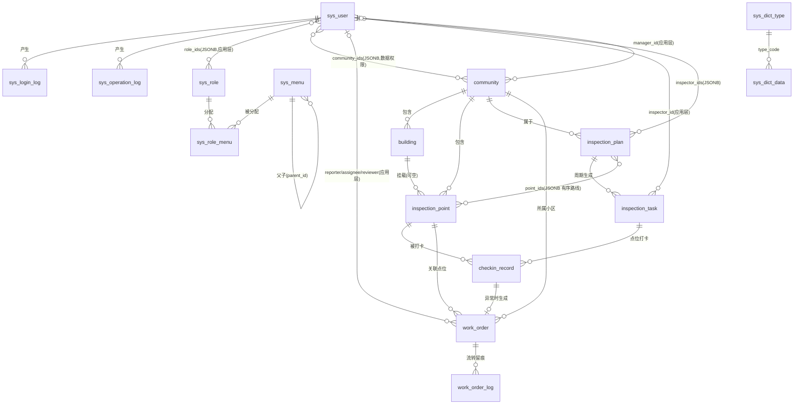

# 物业巡检管理系统 数据库设计文档

> 版本：v1.0
> 数据库：PostgreSQL 15
> 配套文档：`docs/物业巡检管理系统方案.md`（表结构以该文档第五章为基础扩展，字段语义与其保持一致）
> 适用对象：后端开发（Go + GORM）、DBA、测试

---

## 一、数据库概览

### 1.1 基本信息

| 项 | 约定 |
|---|---|
| 数据库 | PostgreSQL 15+ |
| 数据库名 | `property_inspection` |
| 字符集 | `UTF8`（建库时指定 `ENCODING 'UTF8'`） |
| 排序规则 | `zh_CN.UTF-8` 或 `C.UTF-8`（按部署环境，中文排序依赖应用层） |
| 时区 | `Asia/Shanghai`，所有时间字段统一使用 `timestamptz` |
| Schema | 默认 `public`，不额外拆分 schema |

### 1.2 命名规范

- **表名、字段名**：全部蛇形命名（snake_case），小写；业务表无前缀，系统管理表统一 `sys_` 前缀。
- **主键**：统一字段名 `id`，类型 `uuid`，**应用层生成 UUIDv7**（`github.com/google/uuid` NewV7），不依赖数据库默认值（PG 15 无 `uuidv7()` 函数）。UUIDv7 时间有序，索引局部性好；应用层/客户端生成为多租户与分布式扩展预留——典型场景为小程序离线打卡：客户端暂存时生成 UUIDv7 作为记录 ID，补传/重试携带同一 ID，服务端幂等返回已有记录（见 §5.6 与接口文档 §3.3）。外键列同为 `uuid` 类型；`sys_menu.parent_id` 以 NULL 表示根节点。
- **时间字段**：所有表统一包含 `created_at timestamptz NOT NULL DEFAULT now()`、`updated_at timestamptz NOT NULL DEFAULT now()`（`updated_at` 由应用层 GORM `autoUpdateTime` 维护，不建触发器）；支持软删除的表另含 `deleted_at timestamptz NULL`。
- **软删除**：`deleted_at IS NULL` 表示有效数据，删除即写入当前时间戳。GORM `gorm.DeletedAt` 直接映射。唯一约束涉及软删除表时，一律使用 **部分唯一索引**（`WHERE deleted_at IS NULL`），避免软删后同名数据无法重建。
- **索引命名**：`idx_<表名>_<字段>`；唯一索引 `uk_<表名>_<字段>`；外键 `fk_<表名>_<字段>`。
- **金额/数量**：本系统无金额字段；距离（米）用 `numeric(10,2)`，半径用 `int`（米）。

### 1.3 扩展

```sql
CREATE EXTENSION IF NOT EXISTS pgcrypto;   -- gen_random_uuid()，用于工单编号、二维码编号等随机串生成
-- CREATE EXTENSION IF NOT EXISTS postgis;  -- 【可选】本期不启用。坐标用 numeric 存储 + Haversine 计算；
                                            -- 如需复杂电子围栏/轨迹分析再启用，届时将经纬度列迁移为 geography(Point)
```

---

## 二、ER 关系说明

全库共 **17 张表**，分三个域：

- **系统管理域**：`sys_user` / `sys_role` / `sys_menu` / `sys_role_menu` / `sys_dict_type` / `sys_dict_data` / `sys_config` / `sys_login_log` / `sys_operation_log`。RBAC 核心为多对多：`sys_user`（`role_ids` JSONB 数组）↔ `sys_role` ↔ `sys_role_menu` ↔ `sys_menu`；数据权限通过 `sys_user.community_ids`（JSONB 小区 ID 数组）+ `sys_role.data_scope` 实现。
- **巡检业务域**：`community` 1─N `building` 1─N `inspection_point`；`inspection_plan` 通过 `point_ids`（JSONB 有序数组）引用多个点位、通过 `inspector_ids` 引用多个巡检员；计划按周期生成 `inspection_task`，任务下的每次点位打卡写入 `checkin_record`。
- **工单域**：`checkin_record` 结果为异常时生成 `work_order`（`checkin_id` 关联），工单每次流转写 `work_order_log`。

> 说明：`sys_user` 与业务表之间（inspector_id、manager_id、assignee_id 等）**只在应用层保证引用，不建物理外键**——sys_user 走软删除且跨域，物理外键会阻碍软删与后续分库。域内强一致关系（如 community→building→inspection_point、task→checkin、order→log）建物理外键。



---

## 三、完整表设计（DDL）

> 所有 DDL 为 PostgreSQL 15 方言，可直接按本章顺序执行。所有状态/枚举字段用 `varchar` + `CHECK` 约束实现（不用 PostgreSQL ENUM 类型，避免后续加值需要 `ALTER TYPE` 的迁移成本）。

### 3.1 系统管理域

#### sys_user（用户表：后台账号 + 巡检员/维修工账号）

```sql
CREATE TABLE sys_user (
    id              bigint GENERATED ALWAYS AS IDENTITY PRIMARY KEY,
    username        varchar(64)  NOT NULL,                       -- 登录账号（后台用户名或手机号）
    password        varchar(128) NOT NULL,                       -- bcrypt 哈希，不存明文
    name            varchar(64)  NOT NULL,                       -- 真实姓名
    phone           varchar(20)  NOT NULL DEFAULT '',            -- 手机号（小程序绑定、通知用）
    openid          varchar(64)  NULL,                           -- 微信小程序 openid，后台账号为空
    avatar          varchar(512) NOT NULL DEFAULT '',            -- 头像 URL
    role_ids        jsonb        NOT NULL DEFAULT '[]'::jsonb,   -- 角色 ID 数组，如 [1,3]；超管含角色 code=super_admin
    community_ids   jsonb        NOT NULL DEFAULT '[]'::jsonb,   -- 数据权限：所辖小区 ID 数组；角色 data_scope=all 时忽略
    user_type       varchar(16)  NOT NULL DEFAULT 'admin',       -- admin 后台 / inspector 巡检员 / repair 维修工
    status          varchar(16)  NOT NULL DEFAULT 'enabled',     -- enabled 启用 / disabled 停用
    last_login_at   timestamptz  NULL,                           -- 最近登录时间
    remark          varchar(255) NOT NULL DEFAULT '',
    created_at      timestamptz  NOT NULL DEFAULT now(),
    updated_at      timestamptz  NOT NULL DEFAULT now(),
    deleted_at      timestamptz  NULL,
    CONSTRAINT chk_sys_user_type   CHECK (user_type IN ('admin','inspector','repair')),
    CONSTRAINT chk_sys_user_status CHECK (status IN ('enabled','disabled'))
);
COMMENT ON TABLE  sys_user               IS '系统用户（后台管理员/巡检员/维修工）';
COMMENT ON COLUMN sys_user.username      IS '登录账号，全局唯一（软删部分唯一索引）';
COMMENT ON COLUMN sys_user.password      IS 'bcrypt 密码哈希';
COMMENT ON COLUMN sys_user.openid        IS '微信小程序 openid，小程序登录凭据';
COMMENT ON COLUMN sys_user.role_ids      IS 'JSONB 角色 ID 数组，应用层关联 sys_role';
COMMENT ON COLUMN sys_user.community_ids IS 'JSONB 小区 ID 数组，数据权限（按小区隔离）';
COMMENT ON COLUMN sys_user.user_type     IS '用户类型：admin/inspector/repair';
COMMENT ON COLUMN sys_user.status        IS 'enabled 启用 / disabled 停用';

-- 登录按 username 精确匹配（uk 同时服务该查询）；软删后允许同名账号重建
CREATE UNIQUE INDEX uk_sys_user_username ON sys_user (username) WHERE deleted_at IS NULL;
-- 小程序 code 换登录态时按 openid 查找用户
CREATE UNIQUE INDEX uk_sys_user_openid   ON sys_user (openid)   WHERE openid IS NOT NULL AND deleted_at IS NULL;
-- 用户管理列表按类型+状态筛选分页
CREATE INDEX idx_sys_user_type_status    ON sys_user (user_type, status) WHERE deleted_at IS NULL;
-- 按手机号检索用户（后台搜索、巡检员列表）
CREATE INDEX idx_sys_user_phone          ON sys_user (phone) WHERE deleted_at IS NULL;
```

#### sys_role（角色表）

```sql
CREATE TABLE sys_role (
    id          bigint GENERATED ALWAYS AS IDENTITY PRIMARY KEY,
    code        varchar(64)  NOT NULL,                       -- 角色编码，如 super_admin/manager/inspector/repair
    name        varchar(64)  NOT NULL,                       -- 角色名称，如 物业主管
    data_scope  varchar(16)  NOT NULL DEFAULT 'custom',      -- all 全部小区 / custom 按 sys_user.community_ids
    remark      varchar(255) NOT NULL DEFAULT '',
    status      varchar(16)  NOT NULL DEFAULT 'enabled',     -- enabled / disabled
    created_at  timestamptz  NOT NULL DEFAULT now(),
    updated_at  timestamptz  NOT NULL DEFAULT now(),
    deleted_at  timestamptz  NULL,
    CONSTRAINT chk_sys_role_scope  CHECK (data_scope IN ('all','custom')),
    CONSTRAINT chk_sys_role_status CHECK (status IN ('enabled','disabled'))
);
COMMENT ON TABLE  sys_role            IS '角色（RBAC）';
COMMENT ON COLUMN sys_role.code       IS '角色编码，程序内引用（如超管 super_admin），唯一';
COMMENT ON COLUMN sys_role.data_scope IS '数据范围：all 全部数据 / custom 按用户 community_ids 过滤';

-- 按 code 查找角色（登录时加载权限）
CREATE UNIQUE INDEX uk_sys_role_code ON sys_role (code) WHERE deleted_at IS NULL;
```

#### sys_menu（菜单/权限点表）

```sql
CREATE TABLE sys_menu (
    id          bigint GENERATED ALWAYS AS IDENTITY PRIMARY KEY,
    parent_id   bigint       NOT NULL DEFAULT 0,             -- 父菜单 ID，0 为根（不自建外键，允许根节点 0）
    title       varchar(64)  NOT NULL,                       -- 菜单标题
    path        varchar(255) NOT NULL DEFAULT '',            -- 前端路由路径或组件路径，按钮类型为空
    icon        varchar(64)  NOT NULL DEFAULT '',            -- 图标（Element Plus Icons 名）
    type        varchar(8)   NOT NULL,                       -- dir 目录 / menu 菜单 / button 按钮权限点
    perms       varchar(128) NOT NULL DEFAULT '',            -- 权限标识，如 inspection:point:create
    sort        int          NOT NULL DEFAULT 0,             -- 同级排序，升序
    visible     boolean      NOT NULL DEFAULT true,          -- 是否在侧边栏显示（按钮类为 false）
    status      varchar(16)  NOT NULL DEFAULT 'enabled',     -- enabled / disabled
    created_at  timestamptz  NOT NULL DEFAULT now(),
    updated_at  timestamptz  NOT NULL DEFAULT now(),
    deleted_at  timestamptz  NULL,
    CONSTRAINT chk_sys_menu_type   CHECK (type IN ('dir','menu','button')),
    CONSTRAINT chk_sys_menu_status CHECK (status IN ('enabled','disabled'))
);
COMMENT ON TABLE  sys_menu         IS '菜单与按钮权限点（树形）';
COMMENT ON COLUMN sys_menu.perms   IS '权限标识，后端 RBAC 中间件按此鉴权';
COMMENT ON COLUMN sys_menu.type    IS 'dir 目录 / menu 菜单 / button 按钮权限点';

-- 构建菜单树：按 parent_id 取子节点并按 sort 排序（登录下发路由、菜单管理页高频）
CREATE INDEX idx_sys_menu_parent_sort ON sys_menu (parent_id, sort) WHERE deleted_at IS NULL;
-- 按权限标识反查（鉴权中间件、角色分配回显）
CREATE INDEX idx_sys_menu_perms       ON sys_menu (perms)           WHERE deleted_at IS NULL AND perms <> '';
```

#### sys_role_menu（角色-菜单关联表）

```sql
CREATE TABLE sys_role_menu (
    role_id bigint NOT NULL REFERENCES sys_role (id) ON DELETE CASCADE,
    menu_id bigint NOT NULL REFERENCES sys_menu (id) ON DELETE CASCADE,
    PRIMARY KEY (role_id, menu_id)                          -- 联合主键即唯一约束，防重复分配
);
COMMENT ON TABLE sys_role_menu IS '角色-菜单多对多关联';

-- 反向查询：某菜单被哪些角色持有（菜单删除前校验）
CREATE INDEX idx_sys_role_menu_menu ON sys_role_menu (menu_id);
```

#### sys_dict_type / sys_dict_data（字典）

```sql
CREATE TABLE sys_dict_type (
    id          bigint GENERATED ALWAYS AS IDENTITY PRIMARY KEY,
    code        varchar(64)  NOT NULL,                       -- 字典类型编码，如 work_order_status
    name        varchar(64)  NOT NULL,                       -- 字典类型名称
    remark      varchar(255) NOT NULL DEFAULT '',
    created_at  timestamptz  NOT NULL DEFAULT now(),
    updated_at  timestamptz  NOT NULL DEFAULT now(),
    deleted_at  timestamptz  NULL
);
COMMENT ON TABLE sys_dict_type IS '字典类型';

-- 字典编码唯一。注意：作为 sys_dict_data 的外键目标，不能使用部分唯一索引（PG 不允许），
-- 因此 code 全局唯一、软删后亦不释放（字典类型编码为稳定标识，无重建需求）
CREATE UNIQUE INDEX uk_sys_dict_type_code ON sys_dict_type (code);

CREATE TABLE sys_dict_data (
    id          bigint GENERATED ALWAYS AS IDENTITY PRIMARY KEY,
    type_code   varchar(64)  NOT NULL REFERENCES sys_dict_type (code),  -- 关联字典类型编码
    label       varchar(64)  NOT NULL,                       -- 显示文本，如 待派单
    value       varchar(64)  NOT NULL,                       -- 存储值，如 pending
    sort        int          NOT NULL DEFAULT 0,
    status      varchar(16)  NOT NULL DEFAULT 'enabled',
    remark      varchar(255) NOT NULL DEFAULT '',
    created_at  timestamptz  NOT NULL DEFAULT now(),
    updated_at  timestamptz  NOT NULL DEFAULT now(),
    deleted_at  timestamptz  NULL,
    CONSTRAINT chk_sys_dict_data_status CHECK (status IN ('enabled','disabled'))
);
COMMENT ON TABLE sys_dict_data IS '字典数据（可配置枚举项）';

-- 同类型下 value 唯一，防止配置重复
CREATE UNIQUE INDEX uk_sys_dict_data_type_value ON sys_dict_data (type_code, value) WHERE deleted_at IS NULL;
-- 前端/后端按类型拉取启用字典项（登录后全量加载缓存到 Redis）
CREATE INDEX idx_sys_dict_data_type ON sys_dict_data (type_code, status, sort) WHERE deleted_at IS NULL;
```

#### sys_config（系统参数）

```sql
CREATE TABLE sys_config (
    id          bigint GENERATED ALWAYS AS IDENTITY PRIMARY KEY,
    key         varchar(64)  NOT NULL,                       -- 参数键，如 inspection.fence_default_radius
    name        varchar(64)  NOT NULL,                       -- 参数名称（中文说明）
    value       text         NOT NULL DEFAULT '',            -- 参数值（统一存字符串，应用层按约定解析）
    remark      varchar(255) NOT NULL DEFAULT '',
    created_at  timestamptz  NOT NULL DEFAULT now(),
    updated_at  timestamptz  NOT NULL DEFAULT now(),
    deleted_at  timestamptz  NULL
);
COMMENT ON TABLE sys_config IS '系统参数配置（围栏半径、水印开关、作弊阈值等）';

-- 运行时按 key 读取参数（启动加载 + 修改后刷新 Redis 缓存）
CREATE UNIQUE INDEX uk_sys_config_key ON sys_config (key) WHERE deleted_at IS NULL;
```

#### sys_login_log（登录日志）

```sql
CREATE TABLE sys_login_log (
    id          bigint GENERATED ALWAYS AS IDENTITY PRIMARY KEY,
    user_id     bigint       NULL,                           -- 登录用户 ID；登录失败（账号不存在）时为 NULL
    username    varchar(64)  NOT NULL DEFAULT '',            -- 登录时输入的账号（冗余，失败也能留痕）
    channel     varchar(16)  NOT NULL DEFAULT 'admin',       -- admin 后台 / mp 小程序
    ip          varchar(64)  NOT NULL DEFAULT '',
    ua          varchar(512) NOT NULL DEFAULT '',            -- User-Agent / 小程序设备信息
    status      varchar(16)  NOT NULL,                       -- success / fail
    msg         varchar(255) NOT NULL DEFAULT '',            -- 失败原因
    created_at  timestamptz  NOT NULL DEFAULT now(),
    CONSTRAINT chk_sys_login_log_channel CHECK (channel IN ('admin','mp')),
    CONSTRAINT chk_sys_login_log_status  CHECK (status IN ('success','fail'))
);
COMMENT ON TABLE sys_login_log IS '登录日志（只增不改，无 updated_at/deleted_at）';

-- 日志检索：按人 + 时间倒序
CREATE INDEX idx_sys_login_log_user_time ON sys_login_log (user_id, created_at DESC);
-- 日志检索：全局按时间分页 + 清理过期数据
CREATE INDEX idx_sys_login_log_time      ON sys_login_log (created_at DESC);
```

#### sys_operation_log（操作日志，大表）

```sql
CREATE TABLE sys_operation_log (
    id          bigint GENERATED ALWAYS AS IDENTITY,
    user_id     bigint       NULL,
    username    varchar(64)  NOT NULL DEFAULT '',            -- 冗余用户名，检索免联表
    module      varchar(64)  NOT NULL DEFAULT '',            -- 模块，如 inspection / workorder / system
    action      varchar(64)  NOT NULL DEFAULT '',            -- 操作，如 create / update / assign / review
    method      varchar(8)   NOT NULL DEFAULT '',            -- HTTP 方法
    path        varchar(255) NOT NULL DEFAULT '',            -- 请求路径
    params      text         NOT NULL DEFAULT '',            -- 请求参数（脱敏后截断存储，text 不限长）
    ip          varchar(64)  NOT NULL DEFAULT '',
    status      varchar(16)  NOT NULL DEFAULT 'success',     -- success / fail
    cost_ms     int          NOT NULL DEFAULT 0,             -- 耗时毫秒
    created_at  timestamptz  NOT NULL DEFAULT now(),
    PRIMARY KEY (id, created_at),                           -- 声明式分区要求分区键进主键
    CONSTRAINT chk_sys_op_log_status CHECK (status IN ('success','fail'))
) PARTITION BY RANGE (created_at);                          -- 按月分区，见 §5.3
COMMENT ON TABLE sys_operation_log IS '操作日志（按月分区，只增不改）';

-- 日志检索：按人 + 时间倒序（落在各分区上自动创建同名索引）
CREATE INDEX idx_sys_op_log_user_time   ON sys_operation_log (user_id, created_at DESC);
-- 日志检索：按模块 + 时间
CREATE INDEX idx_sys_op_log_module_time ON sys_operation_log (module, created_at DESC);
```

### 3.2 巡检业务域

#### community（小区/项目）

```sql
CREATE TABLE community (
    id          bigint GENERATED ALWAYS AS IDENTITY PRIMARY KEY,
    name        varchar(128) NOT NULL,                       -- 小区名称
    address     varchar(255) NOT NULL DEFAULT '',
    manager_id  bigint       NULL,                           -- 物业主管（sys_user.id，应用层引用，不建外键）
    status      varchar(16)  NOT NULL DEFAULT 'enabled',     -- enabled / disabled
    remark      varchar(255) NOT NULL DEFAULT '',
    created_at  timestamptz  NOT NULL DEFAULT now(),
    updated_at  timestamptz  NOT NULL DEFAULT now(),
    deleted_at  timestamptz  NULL,
    CONSTRAINT chk_community_status CHECK (status IN ('enabled','disabled'))
);
COMMENT ON TABLE community IS '小区/项目';

-- 小区管理列表（按状态筛选 + 名称排序走应用层）
CREATE INDEX idx_community_status  ON community (status) WHERE deleted_at IS NULL;
-- 按主管反查所辖小区（主管登录后的数据权限兜底查询）
CREATE INDEX idx_community_manager ON community (manager_id) WHERE deleted_at IS NULL;
```

#### building（楼栋/区域）

```sql
CREATE TABLE building (
    id           bigint GENERATED ALWAYS AS IDENTITY PRIMARY KEY,
    community_id bigint       NOT NULL REFERENCES community (id),   -- 所属小区
    name         varchar(128) NOT NULL,                             -- 如 1号楼 / 地下车库A区
    type         varchar(16)  NOT NULL DEFAULT 'building',          -- building 楼栋 / area 区域
    sort         int          NOT NULL DEFAULT 0,
    status       varchar(16)  NOT NULL DEFAULT 'enabled',
    created_at   timestamptz  NOT NULL DEFAULT now(),
    updated_at   timestamptz  NOT NULL DEFAULT now(),
    deleted_at   timestamptz  NULL,
    CONSTRAINT chk_building_type   CHECK (type IN ('building','area')),
    CONSTRAINT chk_building_status CHECK (status IN ('enabled','disabled'))
);
COMMENT ON TABLE building IS '楼栋/区域（点位挂载单元）';

-- 同小区内名称唯一（楼栋/区域不重名）
CREATE UNIQUE INDEX uk_building_comm_name ON building (community_id, name) WHERE deleted_at IS NULL;
-- 小区 → 楼栋/区域树（点位管理左侧树高频查询）
CREATE INDEX idx_building_community       ON building (community_id, sort)  WHERE deleted_at IS NULL;
```

#### inspection_point（巡检点位，核心）

```sql
CREATE TABLE inspection_point (
    id                   bigint GENERATED ALWAYS AS IDENTITY PRIMARY KEY,
    community_id         bigint       NOT NULL REFERENCES community (id),
    building_id          bigint       NULL REFERENCES building (id),   -- 可空：直接挂在小区下的露天点位
    name                 varchar(128) NOT NULL,                        -- 点位名称，如 配电房
    type                 varchar(32)  NOT NULL DEFAULT 'common',       -- 点位类型，走字典 point_type（common/power_room/fire_control/pump_room/elevator/garage...）
    qrcode_no            varchar(64)  NOT NULL,                        -- 二维码编号（全局唯一，打印张贴，扫码打卡校验依据）
    longitude            numeric(10,7) NOT NULL,                       -- 经度，GCJ-02 坐标系
    latitude             numeric(10,7) NOT NULL,                       -- 纬度，GCJ-02 坐标系
    fence_radius         int          NOT NULL DEFAULT 100,            -- GPS 围栏半径（米），默认取 sys_config
    checkin_mode         varchar(16)  NOT NULL DEFAULT 'either',       -- qrcode 扫码 / fence 围栏 / either 任一 / both 两者
    required_photo_items jsonb        NOT NULL DEFAULT '[]'::jsonb,    -- 必拍项，如 ["配电箱","消防栓"]，见 §5.1
    sort                 int          NOT NULL DEFAULT 0,
    status               varchar(16)  NOT NULL DEFAULT 'enabled',      -- enabled / disabled（停用后不出现在新任务）
    remark               varchar(255) NOT NULL DEFAULT '',
    created_at           timestamptz  NOT NULL DEFAULT now(),
    updated_at           timestamptz  NOT NULL DEFAULT now(),
    deleted_at           timestamptz  NULL,
    CONSTRAINT chk_point_mode   CHECK (checkin_mode IN ('qrcode','fence','either','both')),
    CONSTRAINT chk_point_status CHECK (status IN ('enabled','disabled')),
    CONSTRAINT chk_point_radius CHECK (fence_radius BETWEEN 10 AND 2000),
    CONSTRAINT chk_point_lng    CHECK (longitude BETWEEN -180 AND 180),
    CONSTRAINT chk_point_lat    CHECK (latitude  BETWEEN -90  AND 90)
);
COMMENT ON TABLE  inspection_point                IS '巡检点位（二维码 + GPS 围栏双支持）';
COMMENT ON COLUMN inspection_point.qrcode_no      IS '二维码编号，全局唯一；码值编码规则见 §5.4';
COMMENT ON COLUMN inspection_point.longitude      IS 'GCJ-02 经度（与腾讯/微信小程序坐标一致，见 §5.2）';
COMMENT ON COLUMN inspection_point.checkin_mode   IS '打卡方式：qrcode/fence/either(默认)/both';
COMMENT ON COLUMN inspection_point.required_photo_items IS '必拍项 JSONB 字符串数组，少拍不能提交';

-- 扫码打卡：按码值定位点位（小程序打卡热路径）
CREATE UNIQUE INDEX uk_point_qrcode ON inspection_point (qrcode_no) WHERE deleted_at IS NULL;
-- 点位管理：小区 + 状态列表；任务生成时取小区下全部启用点位
CREATE INDEX idx_point_community   ON inspection_point (community_id, status) WHERE deleted_at IS NULL;
-- 点位管理：左侧树按楼栋过滤
CREATE INDEX idx_point_building    ON inspection_point (building_id)          WHERE deleted_at IS NULL;
```

#### inspection_plan（巡检计划）

```sql
CREATE TABLE inspection_plan (
    id            bigint GENERATED ALWAYS AS IDENTITY PRIMARY KEY,
    community_id  bigint       NOT NULL REFERENCES community (id),
    name          varchar(128) NOT NULL,                        -- 计划名称，如 日常巡检
    point_ids     jsonb        NOT NULL DEFAULT '[]'::jsonb,    -- 点位路线（有序 ID 数组），见 §5.1
    cycle_type    varchar(16)  NOT NULL,                        -- daily / weekly / monthly
    cycle_config  jsonb        NOT NULL DEFAULT '{}'::jsonb,    -- 周期细则，见 §5.1
    inspector_ids jsonb        NOT NULL DEFAULT '[]'::jsonb,    -- 指派的巡检员 ID 数组（每人每天生成一条任务）
    start_date    date         NOT NULL,                        -- 计划生效日期
    end_date      date         NULL,                            -- 计划截止日期，NULL 长期有效
    time_window   varchar(32)  NOT NULL DEFAULT '08:00-18:00',  -- 要求执行时段，超时完成标记不及时
    status        varchar(16)  NOT NULL DEFAULT 'enabled',      -- enabled 启用 / disabled 停用（停用即不再生成任务）
    remark        varchar(255) NOT NULL DEFAULT '',
    created_at    timestamptz  NOT NULL DEFAULT now(),
    updated_at    timestamptz  NOT NULL DEFAULT now(),
    deleted_at    timestamptz  NULL,
    CONSTRAINT chk_plan_cycle  CHECK (cycle_type IN ('daily','weekly','monthly')),
    CONSTRAINT chk_plan_status CHECK (status IN ('enabled','disabled')),
    CONSTRAINT chk_plan_dates  CHECK (end_date IS NULL OR end_date >= start_date)
);
COMMENT ON TABLE  inspection_plan              IS '巡检计划（周期生成任务的模板）';
COMMENT ON COLUMN inspection_plan.point_ids    IS '有序点位 ID 数组，任务监控按此顺序展示路线';
COMMENT ON COLUMN inspection_plan.cycle_config IS '周期细则 JSONB，结构随 cycle_type 变化，见 §5.1';
COMMENT ON COLUMN inspection_plan.time_window  IS '要求执行时段，格式 HH:MM-HH:MM';

-- 计划生成任务（每日定时任务）：取启用计划按小区扫描
CREATE INDEX idx_plan_community_status ON inspection_plan (community_id, status) WHERE deleted_at IS NULL;
-- 点位被哪些计划引用（点位停用/删除前校验，jsonb 包含查询）
CREATE INDEX idx_plan_point_ids_gin    ON inspection_plan USING gin (point_ids jsonb_path_ops);
```

#### inspection_task（巡检任务）

```sql
CREATE TABLE inspection_task (
    id            bigint GENERATED ALWAYS AS IDENTITY PRIMARY KEY,
    plan_id       bigint       NOT NULL REFERENCES inspection_plan (id),
    community_id  bigint       NOT NULL REFERENCES community (id),  -- 冗余，报表/数据权限过滤免联表
    inspector_id  bigint       NOT NULL,                            -- 巡检员（sys_user.id，应用层引用）
    task_date     date         NOT NULL,                            -- 任务日期（计划生成）
    status        varchar(16)  NOT NULL DEFAULT 'pending',          -- pending/doing/done/overdue，见 §4
    total_points  int          NOT NULL DEFAULT 0,                  -- 点位总数（生成任务时快照 plan.point_ids 长度）
    done_points   int          NOT NULL DEFAULT 0,                  -- 已打卡点数（打卡回调原子 +1）
    started_at    timestamptz  NULL,                                -- 首次打卡时间
    finished_at   timestamptz  NULL,                                -- 全部点位完成时间
    created_at    timestamptz  NOT NULL DEFAULT now(),
    updated_at    timestamptz  NOT NULL DEFAULT now(),
    deleted_at    timestamptz  NULL,
    CONSTRAINT chk_task_status CHECK (status IN ('pending','doing','done','overdue')),
    CONSTRAINT chk_task_points CHECK (done_points >= 0 AND total_points >= 0 AND done_points <= total_points)
);
COMMENT ON TABLE  inspection_task            IS '巡检任务（计划按日/人实例化）';
COMMENT ON COLUMN inspection_task.task_date  IS '任务归属日期；与 plan_id+inspector_id 联合唯一，保证计划生成幂等';
COMMENT ON COLUMN inspection_task.done_points IS '进度计数，打卡成功事务内 +1，与 checkin_record 最终一致';

-- 幂等约束：同一计划同一天同一巡检员只生成一条任务（分布式锁兜底之外的 DB 层保障）
CREATE UNIQUE INDEX uk_task_plan_date_inspector ON inspection_task (plan_id, task_date, inspector_id) WHERE deleted_at IS NULL;
-- 任务监控/工作台：按日期 + 状态扫描（今日任务、逾期任务、完成率统计，最高频查询）
CREATE INDEX idx_task_date_status   ON inspection_task (task_date, status) WHERE deleted_at IS NULL;
-- 小程序「今日任务/历史记录」：按巡检员 + 日期
CREATE INDEX idx_task_inspector_date ON inspection_task (inspector_id, task_date DESC) WHERE deleted_at IS NULL;
-- 报表/数据权限：按小区 + 日期聚合
CREATE INDEX idx_task_community_date ON inspection_task (community_id, task_date) WHERE deleted_at IS NULL;
```

#### checkin_record（打卡记录，核心大表）

```sql
CREATE TABLE checkin_record (
    id                bigint GENERATED ALWAYS AS IDENTITY,
    task_id           bigint       NOT NULL REFERENCES inspection_task (id),
    point_id          bigint       NOT NULL REFERENCES inspection_point (id),
    inspector_id      bigint       NOT NULL,                          -- 冗余任务上的巡检员，检索免联表
    community_id      bigint       NOT NULL,                          -- 冗余，数据权限/报表过滤免联表
    checkin_time      timestamptz  NOT NULL DEFAULT now(),            -- 服务端打卡时间（不信任客户端）
    client_time       timestamptz  NULL,                              -- 客户端原始时间（离线补传时保留）
    longitude         numeric(10,7) NULL,                             -- 打卡时 GPS 经度（GCJ-02），纯扫码弱信号场景可空
    latitude          numeric(10,7) NULL,
    distance_to_point numeric(10,2) NULL,                             -- 打卡坐标与点位距离（米），服务端 Haversine 计算
    checkin_type      varchar(16)  NOT NULL,                          -- qrcode / fence / offline（离线补传）
    photos            jsonb        NOT NULL DEFAULT '[]'::jsonb,      -- 照片数组，结构见 §5.1
    result            varchar(16)  NOT NULL DEFAULT 'normal',         -- normal 正常 / abnormal 异常（触发工单）
    remark            varchar(512) NOT NULL DEFAULT '',               -- 异常描述或备注
    is_offline_sync   boolean      NOT NULL DEFAULT false,            -- 是否离线补传
    is_suspect        boolean      NOT NULL DEFAULT false,            -- 疑似作弊标记（距离超阈值/EXIF 偏差等）
    suspect_reason    varchar(255) NOT NULL DEFAULT '',               -- 疑似作弊原因说明
    created_at        timestamptz  NOT NULL DEFAULT now(),
    PRIMARY KEY (id, created_at),                                     -- 分区表主键须含分区键
    CONSTRAINT chk_checkin_type   CHECK (checkin_type IN ('qrcode','fence','offline')),
    CONSTRAINT chk_checkin_result CHECK (result IN ('normal','abnormal'))
) PARTITION BY RANGE (created_at);                                    -- 按月分区，见 §5.3
COMMENT ON TABLE  checkin_record                  IS '打卡记录（按月分区，只增不改；不允许删除，防篡改审计要求）';
COMMENT ON COLUMN checkin_record.checkin_time     IS '服务端时间，准点率/及时率统计以此为准';
COMMENT ON COLUMN checkin_record.client_time      IS '客户端上报的原始时间，离线补传场景用于复核展示';
COMMENT ON COLUMN checkin_record.distance_to_point IS '距点位距离（米），超 fence_radius 即标疑似作弊';
COMMENT ON COLUMN checkin_record.photos           IS '带水印照片数组 [{item,url,watermarked_url,exif_time}]';

-- 同一任务同一点位只允许一条有效打卡（重复提交/重试幂等；补传冲突由应用层拒绝）。
-- 分区表唯一索引必须包含分区键，故带上 created_at；同一 task+point 的秒级重复提交仍会被拦截，
-- 跨时间的重复打卡由应用层「查已有记录即拒绝」+ Redis 锁 lock:checkin 兜底
CREATE UNIQUE INDEX uk_checkin_task_point ON checkin_record (task_id, point_id, created_at);
-- 任务监控明细：取任务下全部打卡记录
CREATE INDEX idx_checkin_task          ON checkin_record (task_id);
-- 巡检记录检索：按人 + 时间（历史记录、绩效统计）
CREATE INDEX idx_checkin_inspector_time ON checkin_record (inspector_id, checkin_time DESC);
-- 巡检记录检索：按点位 + 时间（点位维度回溯照片）
CREATE INDEX idx_checkin_point_time    ON checkin_record (point_id, checkin_time DESC);
-- 疑似作弊专项筛选（任务监控 Tab「疑似作弊」、作弊报表）
CREATE INDEX idx_checkin_suspect       ON checkin_record (is_suspect, checkin_time DESC) WHERE is_suspect;
```

#### work_order（异常工单）

```sql
CREATE TABLE work_order (
    id           bigint GENERATED ALWAYS AS IDENTITY PRIMARY KEY,
    order_no     varchar(32)  NOT NULL,                          -- 工单号 WX20260805-003，生成规则见 §5.4
    checkin_id   bigint       NULL,                              -- 来源打卡记录（checkin_record.id，应用层引用；分区表不便建 FK）
    community_id bigint       NOT NULL REFERENCES community (id),
    point_id     bigint       NULL REFERENCES inspection_point (id),
    title        varchar(128) NOT NULL,
    description  text         NOT NULL DEFAULT '',
    photos       jsonb        NOT NULL DEFAULT '[]'::jsonb,      -- 异常照片（URL 数组）
    reporter_id  bigint       NOT NULL,                          -- 上报人（巡检员）
    assignee_id  bigint       NULL,                              -- 处理人（维修工，派单后赋值）
    priority     varchar(16)  NOT NULL DEFAULT 'normal',         -- low / normal / high / urgent
    status       varchar(16)  NOT NULL DEFAULT 'pending',        -- 状态机见 §4.2
    fix_photos   jsonb        NOT NULL DEFAULT '[]'::jsonb,      -- 维修结果照片
    fix_remark   varchar(512) NOT NULL DEFAULT '',               -- 维修反馈说明
    finished_at  timestamptz  NULL,                              -- 处理完成时间
    reviewed_by  bigint       NULL,                              -- 复核人（主管）
    review_remark varchar(512) NOT NULL DEFAULT '',              -- 复核意见（驳回必填）
    created_at   timestamptz  NOT NULL DEFAULT now(),
    updated_at   timestamptz  NOT NULL DEFAULT now(),
    deleted_at   timestamptz  NULL,
    CONSTRAINT chk_order_priority CHECK (priority IN ('low','normal','high','urgent')),
    CONSTRAINT chk_order_status   CHECK (status IN ('pending','assigned','processing','review','closed','rejected'))
);
COMMENT ON TABLE  work_order          IS '异常工单（上报→派单→处理→复核→关闭闭环）';
COMMENT ON COLUMN work_order.order_no IS '业务单号，全局唯一，规则 WX+日期+序号，见 §5.4';
COMMENT ON COLUMN work_order.status   IS 'pending 待派单/assigned 已派单/processing 处理中/review 待复核/closed 已关闭/rejected 已驳回';

-- 按单号精确查询（小程序 toast 展示后用户报单号追溯）
CREATE UNIQUE INDEX uk_order_no        ON work_order (order_no) WHERE deleted_at IS NULL;
-- 工单列表状态 Tab（待派单/处理中/待复核/已关闭，最高频查询）
CREATE INDEX idx_order_status          ON work_order (status, created_at DESC) WHERE deleted_at IS NULL;
-- 数据权限 + 列表筛选：按小区 + 状态
CREATE INDEX idx_order_community_status ON work_order (community_id, status) WHERE deleted_at IS NULL;
-- 维修工「我的工单」：按处理人 + 状态
CREATE INDEX idx_order_assignee        ON work_order (assignee_id, status) WHERE deleted_at IS NULL;
-- 巡检员「我上报的工单」
CREATE INDEX idx_order_reporter        ON work_order (reporter_id, created_at DESC) WHERE deleted_at IS NULL;
-- 从打卡记录反查工单（任务监控联动工单、防一卡多单）
CREATE INDEX idx_order_checkin         ON work_order (checkin_id) WHERE deleted_at IS NULL;
```

#### work_order_log（工单流转日志）

```sql
CREATE TABLE work_order_log (
    id          bigint GENERATED ALWAYS AS IDENTITY PRIMARY KEY,
    order_id    bigint       NOT NULL REFERENCES work_order (id) ON DELETE CASCADE,
    action      varchar(32)  NOT NULL,                         -- create/assign/accept/finish/review_pass/review_reject/close
    operator_id bigint       NOT NULL,                         -- 操作人（sys_user.id）
    detail      varchar(512) NOT NULL DEFAULT '',              -- 操作详情（如派单给某人、驳回原因）
    created_at  timestamptz  NOT NULL DEFAULT now(),
    CONSTRAINT chk_order_log_action CHECK (action IN ('create','assign','accept','finish','review_pass','review_reject','close'))
);
COMMENT ON TABLE work_order_log IS '工单流转留痕（只增不改）';

-- 工单详情右侧流转时间线：按工单取全量按时间升序
CREATE INDEX idx_order_log_order ON work_order_log (order_id, created_at);
```

---

## 四、枚举与字典

### 4.1 状态字段取值总表

枚举分两类：**代码级枚举**（CHECK 约束固化，流转逻辑由代码控制，不开放配置）与**字典级枚举**（`sys_dict_data` 可配展示文案，值与 CHECK 保持一致）。下表"字典类型"列即预置的 `sys_dict_type.code`。

| 表.字段 | 取值 | 含义 | 字典类型 |
|---|---|---|---|
| sys_user.user_type | admin / inspector / repair | 后台 / 巡检员 / 维修工 | user_type |
| sys_user.status | enabled / disabled | 启用 / 停用 | common_status |
| sys_role.data_scope | all / custom | 全部数据 / 按小区 | data_scope |
| sys_menu.type | dir / menu / button | 目录 / 菜单 / 按钮 | menu_type |
| sys_login_log.status | success / fail | 成功 / 失败 | — |
| sys_operation_log.status | success / fail | 成功 / 失败 | — |
| community.status | enabled / disabled | 启用 / 停用 | common_status |
| building.type | building / area | 楼栋 / 区域 | building_type |
| inspection_point.type | common / power_room / fire_control / pump_room / elevator / garage（可扩展） | 点位类型 | point_type |
| inspection_point.checkin_mode | qrcode / fence / either / both | 扫码 / 围栏 / 任一 / 两者 | checkin_mode |
| inspection_plan.cycle_type | daily / weekly / monthly | 每天 / 每周 / 每月 | cycle_type |
| inspection_plan.status | enabled / disabled | 启用 / 停用 | common_status |
| inspection_task.status | pending / doing / done / overdue | 待开始 / 进行中 / 已完成 / 已逾期 | task_status |
| checkin_record.checkin_type | qrcode / fence / offline | 扫码 / 围栏 / 离线补传 | checkin_type |
| checkin_record.result | normal / abnormal | 正常 / 异常 | checkin_result |
| work_order.priority | low / normal / high / urgent | 低 / 普通 / 高 / 紧急 | order_priority |
| work_order.status | pending / assigned / processing / review / closed / rejected | 见 §4.2 | work_order_status |
| work_order_log.action | create / assign / accept / finish / review_pass / review_reject / close | 见 §4.2 | — |

### 4.2 状态流转说明

**inspection_task.status（任务状态机）**

```
pending(待开始) ──首次打卡──▶ doing(进行中) ──全部点位完成──▶ done(已完成)
    │                            │
    │  task_date 结束仍未开始      │  task_date 结束仍有未打卡点位
    └──────────────┬─────────────┘
                   ▼
              overdue(已逾期)  ← 终态，由每日定时任务(次日 00:10)批量翻转
```

- `doing → done`：打卡事务内 `done_points` 达到 `total_points` 时原子置位，同时写 `finished_at`。
- `done` 与 `overdue` 互斥；逾期内补打完成的按「已完成但不及时」处理：状态仍为 `done`，及时率统计时以 `finished_at` 与 `task_date + time_window` 比较判定，不引入第五种状态。

**work_order.status（工单状态机）**

```
pending(待派单) ──assign──▶ assigned(已派单) ──accept──▶ processing(处理中)
                                                       ──finish──▶ review(待复核)
review ──review_pass──▶ closed(已关闭·终态)
review ──review_reject──▶ processing(驳回返工，review_remark 必填)
```

- `rejected` 保留为「无效工单」终态：主管在 `pending` 阶段可直接驳回关闭（误报场景），动作记 `close`，`review_remark` 记原因。
- 每次状态变化同步写一条 `work_order_log`，应用层在**同一事务**内更新 `work_order` + 插入日志。

---

## 五、关键设计说明

### 5.1 JSONB 字段内部结构

**checkin_record.photos** —— 打卡照片数组，每项对应一个必拍项或补充照片：

```json
[
  {
    "item": "配电箱",
    "url": "https://oss.example.com/checkin/2026/08/05/a1b2.jpg",
    "watermarked_url": "https://oss.example.com/checkin/2026/08/05/a1b2_wm.jpg",
    "exif_time": "2026-08-05T08:41:12+08:00",
    "required": true
  },
  {
    "item": "",
    "url": "https://oss.example.com/checkin/2026/08/05/c3d4.jpg",
    "watermarked_url": "https://oss.example.com/checkin/2026/08/05/c3d4_wm.jpg",
    "exif_time": null,
    "required": false
  }
]
```

- `item` 对应 `inspection_point.required_photo_items` 中的必拍项名称；补充照片 `item` 为空串、`required=false`；
- `exif_time` 为服务端解析的照片拍摄时间，与 `checkin_time` 偏差超阈值（sys_config `inspection.exif_deviation_seconds`）时置 `is_suspect`。

**inspection_plan.cycle_config** —— 随 `cycle_type` 变化：

```json
// daily：每天，interval 为间隔天数（1=每天，2=隔天）
{"interval": 1}

// weekly：按星期几执行（1=周一 ... 7=周日）
{"weekdays": [1, 3, 5]}

// monthly：按每月哪几天执行；-1 表示月末最后一天
{"monthdays": [1, 15, -1]}
```

**inspection_plan.point_ids** —— 有序点位 ID 数组，顺序即巡检路线顺序：

```json
[101, 108, 113, 120, 125]
```

任务生成时将当时点位清单快照进任务的关联数据（应用层按 `point_ids` 顺序展示路线，点位中途停用不影响已生成任务的展示——任务监控以打卡记录 + point_ids 快照为准）。

**inspection_point.required_photo_items**：

```json
["配电箱", "消防栓", "电梯机房"]
```

**work_order.photos / fix_photos** —— 简化的 URL 对象数组：

```json
[{"url": "https://oss.example.com/order/2026/08/x1.jpg", "watermarked_url": "..."}]
```

### 5.2 坐标系说明（GCJ-02）

- 全系统坐标统一 **GCJ-02（火星坐标系）**：微信小程序 `wx.getLocation`（`type: 'gcj02'`）、腾讯地图选点组件输出均为 GCJ-02，入库不做转换；
- `longitude/latitude` 用 `numeric(10,7)`（约 1cm 精度），不用 float，避免浮点比较误差；
- 距离计算在**服务端**用 Haversine 公式完成（`pkg/geo`），不在 SQL 层算，避免全表扫描三角函数；
- **禁止**混入 WGS-84/BD-09 坐标；若未来接第三方地图（百度）需在应用层转换后再入库；
- 未来启用 PostGIS 迁移路径：新增 `geography(Point, 4490)` 列存 GCJ-02 经纬度（PostGIS 不做坐标系强制，按数值存取即可），由应用层双写过渡。

### 5.3 大表策略（分区与归档）

**sys_operation_log、checkin_record** 均为只增不改的流水表，采用 PostgreSQL **声明式 RANGE 分区（按月）**，分区键 `created_at`：

```sql
-- 示例：创建 2026-08 月分区（由部署脚本/月度定时任务提前 1 个月滚动创建）
CREATE TABLE checkin_record_2026_08 PARTITION OF checkin_record
    FOR VALUES FROM ('2026-08-01') TO ('2026-09-01');

CREATE TABLE sys_operation_log_2026_08 PARTITION OF sys_operation_log
    FOR VALUES FROM ('2026-08-01') TO ('2026-09-01');

-- 必须保留一个 default 分区兜底，防止分区未提前创建导致写入失败
CREATE TABLE checkin_record_default PARTITION OF checkin_record DEFAULT;
CREATE TABLE sys_operation_log_default PARTITION OF sys_operation_log DEFAULT;
```

- 分区创建由 Go 侧定时任务（每月 25 日）自动执行，失败告警；
- **归档**：超过 12 个月的分区 `pg_dump` 导出到 OSS 后 `DETACH PARTITION` + `DROP TABLE`，秒级完成，无需 `DELETE` 清表；
- 分区表主键必须包含分区键（故 `id` 与 `created_at` 联合主键）；`id` 的全局唯一由 identity 序列天然保证，跨分区按 `id` 查询时应用层总是同时带上时间范围；
- 注意：声明式分区表**不支持被其他表引用为外键目标**，故 `work_order.checkin_id` 只做应用层关联（已在 DDL 注释中说明）。

### 5.4 编号生成规则

- **工单号 order_no**：`WX` + `yyyyMMdd` + `-` + 3 位日内序号，如 `WX20260805-003`。序号用 Redis `INCR wo:seq:20260805`（当日过期）生成，DB 唯一索引兜底，冲突时重试；
- **二维码编号 qrcode_no**：`P-` + 6 位序列（如 `P-000101`，序号源为 PG 序列 `qrcode_no_seq`，与 UUID 主键解耦，便于打印张贴与口头报号）；二维码内容编码为 `inspection://checkin?no=P-000101`，小程序扫码解析 `no` 后提交打卡。

### 5.5 软删除约定

- 软删除字段 `deleted_at` 仅存在于**主数据表**：sys_user、sys_role、sys_menu、sys_dict_type、sys_dict_data、sys_config、community、building、inspection_point、inspection_plan、inspection_task、work_order；
- **流水表不软删**：sys_login_log、sys_operation_log、checkin_record、work_order_log 只增不改（checkin_record 出于防篡改审计要求连软删都不提供，错误打卡用新记录冲正并由应用层标记）；
- 所有查询默认带 `deleted_at IS NULL`（GORM 自动处理）；唯一约束一律建**部分唯一索引**（`WHERE deleted_at IS NULL`），保证软删后同 key 数据可重建——唯一例外是 `sys_dict_type.code`：作为外键目标必须是全量唯一索引，软删后不释放编码；
- 外键策略：域内引用（community→building→point、task→checkin、order→log）建物理外键，删除走软删不触发级联；`sys_role_menu` 与 `work_order_log` 是真删场景，外键带 `ON DELETE CASCADE`。

### 5.6 并发与一致性要点

- **任务进度**：打卡成功在同一事务内 `INSERT checkin_record` + `UPDATE inspection_task SET done_points = done_points + 1 ...`，Redis 进度缓存（§七）在事务提交后失效重建；
- **重复打卡**：`uk_checkin_task_point` 唯一索引兜底，捕获 `23505` 错误转友好提示「该点位已打卡」；
- **任务生成幂等**：`uk_task_plan_date_inspector` 唯一约束 + Redis 分布式锁（`lock:plan:gen:<date>`）双保险。

---

## 六、初始化数据（系统预置）

### 6.1 预置账号与角色

| 数据 | 内容 |
|---|---|
| 超级管理员 | `sys_user`：username=`admin`，初始密码 `Admin@123`（bcrypt 入库，**首次登录强制改密**），name=`系统管理员`，user_type=`admin`，role_ids=`[1]` |
| 角色 super_admin | id=1，code=`super_admin`，name=`超级管理员`，data_scope=`all` |
| 角色 manager | code=`manager`，name=`物业主管`，data_scope=`custom`（按 community_ids） |
| 角色 inspector | code=`inspector`，name=`巡检员`，data_scope=`custom` |
| 角色 repair | code=`repair`，name=`维修人员`，data_scope=`custom` |

`sys_role_menu`：super_admin 关联全部菜单；manager/inspector/repair 按第六章 6.2 菜单树中标注的默认角色分配（巡检员/维修工仅有小程序接口权限点，无后台菜单）。

### 6.2 菜单树初始数据（sys_menu）

```
工作台            /dashboard            menu   perms: dashboard:view            [超管/主管]
巡检管理          /inspection           dir                                     [超管/主管]
├─ 点位管理       /inspection/points    menu   perms: inspection:point:list     [超管/主管]
│   ├─ 新增/编辑/删除                       button inspection:point:create/update/delete
│   └─ 批量生成二维码                        button inspection:point:qrcode
├─ 巡检计划       /inspection/plans     menu   perms: inspection:plan:list      [超管/主管]
│   └─ 新增/编辑/停用                       button inspection:plan:create/update/disable
├─ 任务监控       /inspection/tasks     menu   perms: inspection:task:monitor   [超管/主管]
└─ 巡检记录       /inspection/records   menu   perms: inspection:record:list    [超管/主管]
异常工单          /workorders           dir                                     [超管/主管]
├─ 工单列表       /workorders/list      menu   perms: workorder:list
│   ├─ 派单                                 button workorder:assign
│   ├─ 复核                                 button workorder:review
│   └─ 导出                                 button workorder:export
统计分析          /stats                dir                                     [超管/主管]
├─ 巡检报表       /stats/inspection     menu   perms: stats:inspection
├─ 绩效报表       /stats/performance    menu   perms: stats:performance
└─ 数据导出                               button stats:export
小区管理          /community            menu   perms: community:list            [超管]
└─ 新增/编辑/删除                          button community:create/update/delete
系统管理          /system               dir                                     [超管]
├─ 用户管理       /system/users         menu   perms: system:user:list（+ create/update/delete/resetPwd 按钮）
├─ 角色管理       /system/roles         menu   perms: system:role:list（+ create/update/delete/assign 按钮）
├─ 菜单管理       /system/menus         menu   perms: system:menu:list（+ create/update/delete 按钮）
├─ 字典管理       /system/dicts         menu   perms: system:dict:list（+ create/update/delete 按钮）
├─ 参数配置       /system/configs       menu   perms: system:config:list（+ update 按钮）
├─ 通知公告       /system/notices       menu   perms: system:notice:list（+ create/delete 按钮）
└─ 日志管理       /system/logs          menu   perms: system:log:list（+ export 按钮）
个人中心          /profile              menu   perms: profile:view              [全部]
```

### 6.3 默认字典（sys_dict_type / sys_dict_data）

按 §4.1 总表全量预置：`common_status`、`user_type`、`data_scope`、`menu_type`、`building_type`、`point_type`、`checkin_mode`、`cycle_type`、`task_status`、`checkin_type`、`checkin_result`、`order_priority`、`work_order_status`。取值与 label 对照即 §4.1「含义」列，此处不再重复罗列。

### 6.4 默认参数（sys_config）

| key | name | value | 说明 |
|---|---|---|---|
| inspection.fence_default_radius | 围栏默认半径(米) | 100 | 新建点位时的默认值 |
| inspection.watermark_enabled | 照片水印开关 | true | 关闭后仅存原图（不推荐） |
| inspection.suspect_distance_ratio | 疑似作弊距离倍数 | 1.0 | 距离 > fence_radius × 该值 时标记疑似作弊 |
| inspection.exif_deviation_seconds | EXIF 时间偏差阈值(秒) | 300 | 照片拍摄时间与打卡时间允许偏差 |
| inspection.task_generate_days | 任务提前生成天数 | 1 | 每日 00:05 生成未来 N 天任务 |
| inspection.overdue_check_time | 逾期翻转时间 | 00:10 | 每日该时刻将昨日未完成任务置 overdue |
| mp.offline_sync_limit | 离线补传单批上限 | 50 | 单次补传最大条数 |
| msg.subscribe_enabled | 微信订阅消息开关 | true | 任务提醒/工单指派/整改驳回 |
| msg.wecom_webhook_enabled | 企业微信工单推送开关 | false | 开启需配置 webhook 地址（应用配置，不入库） |
| security.login_fail_limit | 登录失败锁定次数 | 5 | 连续失败锁定 10 分钟（配合 Redis 计数） |

---

## 七、Redis 使用设计

### 7.1 key 命名规范

- 统一小写，冒号分层：`<业务域>:<用途>:<标识>`，如 `session:admin:1001`；
- 业务域前缀：`session`（会话）、`jwtbl`（JWT 黑名单）、`cache`（读缓存）、`lock`（分布式锁）、`limit`（限流）、`seq`（序号）、`dict`、`config`、`wo`（工单）；
- 标识含日期时用 `yyyyMMdd`，含用户用用户 ID；**禁止**在 key 中拼接中文或用户输入原文。

### 7.2 key 清单

| key 模式 | 类型 | 结构/内容 | TTL | 用途与说明 |
|---|---|---|---|---|
| `session:admin:{userId}` | Hash | `{tokenId, name, roles, loginAt}` | 2h（滑动续期，refresh 7d） | 后台登录会话；JWT access token 校验通过后查此 key 确认会话存活，退出/改密即删 |
| `session:mp:{userId}` | Hash | `{tokenId, openid, name, loginAt}` | 7d | 小程序登录会话（微信用户无感登录，有效期长） |
| `jwtbl:{jti}` | String | `"1"` | = 该 token 剩余有效期 | JWT 黑名单：退出登录/改密/停用账号时将未过期 token 的 jti 写入，鉴权中间件优先查黑名单 |
| `cache:task:progress:{taskId}` | Hash | `{done, total, status}` | 10min | 任务进度缓存：任务监控/小程序进度环高频读；打卡事务提交后 DEL，下次读取回源重建 |
| `cache:dashboard:{date}` | Hash | 今日完成率/进行中/待处理异常/逾期数 | 60s | 工作台聚合结果缓存，多管理员同时打开后台时削峰 |
| `lock:plan:gen:{date}` | String | 实例 ID（SET NX PX） | 10min | 计划生成任务分布式锁，防多实例/重试重复生成（DB 唯一索引兜底） |
| `lock:checkin:{taskId}:{pointId}` | String | 请求 ID（SET NX PX） | 5s | 单点位打卡防并发重复提交（弱网双击/重试场景） |
| `limit:login:{ip}` | String | 失败计数（INCR） | 10min | 登录限流：达 `security.login_fail_limit` 锁定该 IP |
| `limit:api:{userId}:{api}` | String | 计数（INCR，滑动窗口简化为固定窗口） | 1min | 通用接口限流，如 STS 凭证申请、补传接口 |
| `seq:wo:{yyyyMMdd}` | String | 当日序号（INCR） | 48h | 工单号日内序号，见 §5.4 |
| `dict:all` | String(JSON) | 全量启用字典 | 30min，变更即 DEL | 字典缓存，字典管理保存后失效 |
| `config:all` | String(JSON) | 全量系统参数 | 30min，变更即 DEL | 参数缓存，参数配置保存后失效 |
| `mp:wxcode:{code}` | String | openid | 5min | 微信 code→openid 换登录态的中间结果，防 code 重放 |

### 7.3 通用约定

- 所有缓存 key 必须有 TTL，**禁止永久 key**（锁除外，锁 TTL 即租约）；
- 缓存一律「回源重建」模式：读 miss 查库回填，写路径先更库后 DEL 缓存，不做主动 UPDATE 缓存；
- 分布式锁用 `SET key value NX PX <ms>` + Lua 脚本比对 value 后释放，防误删他人锁；
- Redis 宕机降级：会话/黑名单不可降级（拒绝服务并告警），缓存类 key 自动穿透回源数据库，限流放行（fail-open）并告警。

---

## 八、汇总

- **表数量**：**17 张**——系统管理域 9 张（sys_user、sys_role、sys_menu、sys_role_menu、sys_dict_type、sys_dict_data、sys_config、sys_login_log、sys_operation_log），巡检业务域 5 张（community、building、inspection_point、inspection_plan、inspection_task），打卡与工单域 3 张（checkin_record、work_order、work_order_log）。
- **索引数量**：**41 个**（DDL 中 `CREATE [UNIQUE] INDEX` 语句的实际条数，含部分唯一索引，不含主键/联合主键自带索引）。按表清点：sys_user 4、sys_role 1、sys_menu 2、sys_role_menu 1、sys_dict_type 1、sys_dict_data 2、sys_config 1、sys_login_log 2、sys_operation_log 2、community 2、building 2、inspection_point 3、inspection_plan 2、inspection_task 4、checkin_record 5、work_order 6、work_order_log 1。
