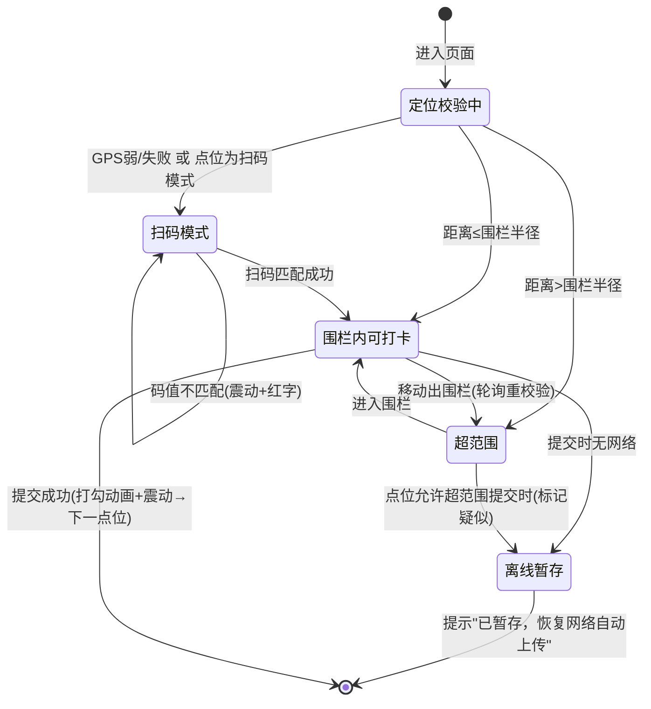
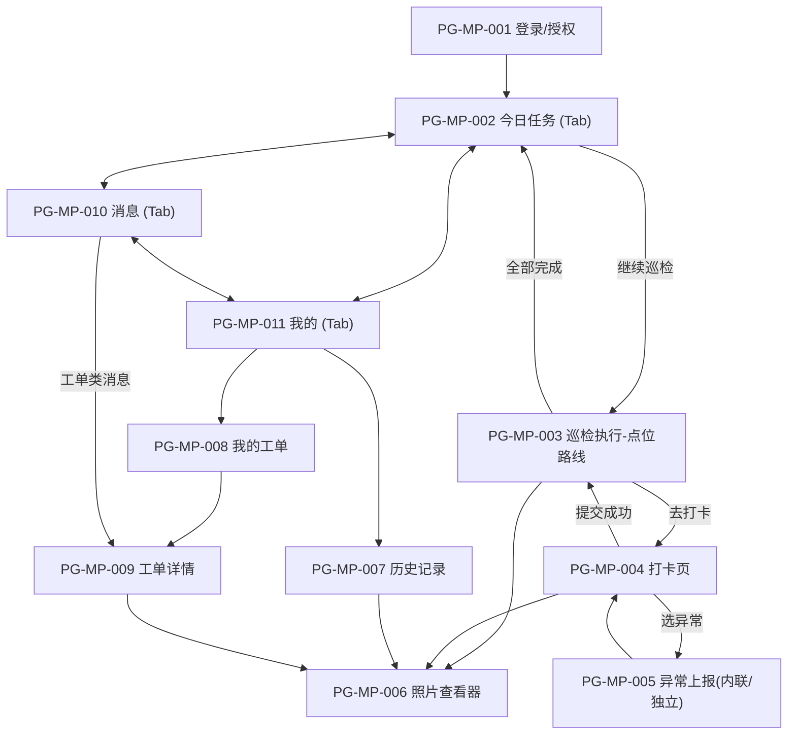
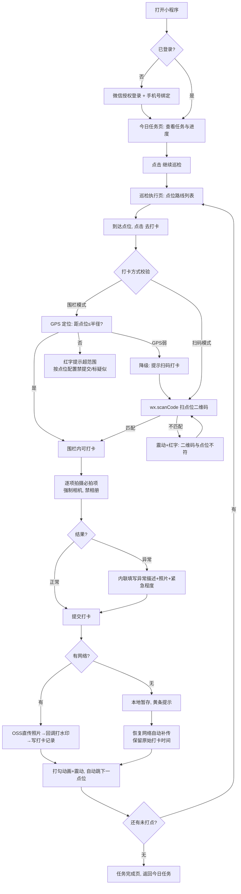
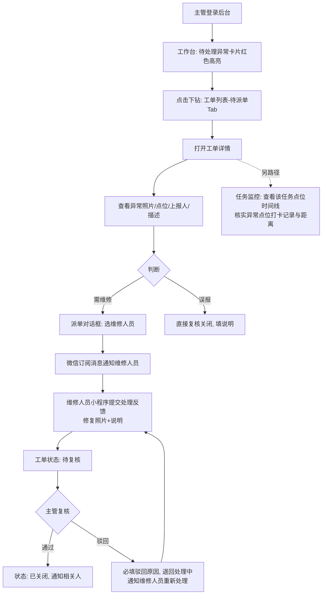

# 页面清单与原型说明

> 版本：v1.0
> 定位：原型设计与前端开发的**页面级依据**。页面范围、功能点、交互范式严格依据以下两份文档，未在此处出现的页面/功能一律不做：
> - `docs/物业巡检管理系统方案.md`（功能与架构，下称"方案文档"）
> - `docs/UI-UX设计方案.md`（视觉与交互规范，下称"UI 文档"）
>
> 适用范围：Web 管理后台（Vue3 + Element Plus）、微信原生小程序。

---

## 〇、阅读约定

**页面编号规则**

| 前缀 | 含义 | 编号区间 |
|---|---|---|
| `PG-ADM-xxx` | Web 管理后台页面 | 001–023 |
| `PG-MP-xxx` | 微信小程序页面 | 001–011 |

**权限点命名规则**（RBAC 按钮级权限，与 `sys_menu.type=button` 对应，风格对齐若依）：

```
模块:实体:动作    例：inspection:point:add
菜单级：inspection:point:list      按钮级：:add / :edit / :remove / :export / ...
```

**路由约定**

- 后台：Vue Router，`/login` 独立全屏页，业务页面全部挂在布局组件 `Layout` 之下，菜单与路由由后端 `GET /api/admin/auth/routes` 按角色动态下发（方案文档 §六）。
- 小程序：原生 `app.json` 页面路径，3 个 TabBar 页（任务/消息/我的，UI 文档 §4.1），其余为普通跳转页。
- 本文中接口名均引用方案文档 §六 的接口表；个别页面（小区/楼栋、通知公告、消息）方案文档接口表未单列，本文按同模块 REST 约定标注并注明"接口文档补充"。

**全局通用规范（各页不再重复描述）**

- 后台所有列表页遵守 UI 文档 §3.2 通用范式：搜索区 + 工具栏 + 表格 + 分页；新增/编辑用抽屉（字段 ≤6）或对话框；删除红色文字 + MessageBox 二次确认；异步按钮 loading + 禁用防重复提交；操作列固定右侧，超过 3 个操作收进"更多 ▾"。
- 状态三件套每个页面都必须实现：**空态**（图标 + 一句指引 + 主操作按钮）、**加载**（>300ms 骨架屏/表格 loading）、**异常**（错误提示 + 重试入口）。
- 小程序触控目标 ≥ 44pt、按压反馈 100ms 内、适配底部安全区（UI 文档 §4.3）。

---

## 一、页面总览清单

### 1.1 后台页面清单（共 23 页）

| 页面编号 | 页面名称 | 路由路径 | 所属菜单 | 所需权限点（菜单级） | 页面说明 |
|---|---|---|---|---|---|
| PG-ADM-001 | 登录 | `/login` | —（独立页） | 无 | 账号密码登录，JWT 换取登录态 |
| PG-ADM-002 | 工作台 | `/dashboard` | 工作台 | 登录即可见 | 完成率/进行中/异常/逾期统计卡、趋势图、小区排行、最新工单 |
| PG-ADM-003 | 点位管理 | `/inspection/point` | 巡检管理 | `inspection:point:list` | 小区/楼栋树 + 点位表格，二维码/围栏/打卡方式/必拍项配置 |
| PG-ADM-004 | 巡检计划 | `/inspection/plan` | 巡检管理 | `inspection:plan:list` | 周期计划（每天/每周/每月）按路线指派巡检员 |
| PG-ADM-005 | 任务监控 | `/inspection/monitor` | 巡检管理 | `inspection:task:list` | 任务卡片列表，状态筛选 Tab，实时进度 |
| PG-ADM-006 | 任务明细 | `/inspection/monitor/detail/:id` | 巡检管理（由任务监控进入） | `inspection:task:detail` | 单任务点位时间线：打卡时间/方式/距离/照片 |
| PG-ADM-007 | 巡检记录 | `/inspection/checkin` | 巡检管理 | `inspection:checkin:list` | 打卡记录检索（人/小区/时间），查看照片原图 |
| PG-ADM-008 | 工单列表 | `/workorder/list` | 异常工单 | `workorder:list` | 状态 Tab（待派单/处理中/待复核/已关闭）+ 表格 |
| PG-ADM-009 | 工单详情 | `/workorder/detail/:id` | 异常工单（由列表进入） | `workorder:detail` | 左右结构：异常信息 + 流转时间线，派单/复核操作 |
| PG-ADM-010 | 统计分析-覆盖率 | `/stats/coverage` | 统计分析 | `stats:coverage:list` | 巡检覆盖率/异常率报表（五段式） |
| PG-ADM-011 | 统计分析-及时率 | `/stats/timeliness` | 统计分析 | `stats:timeliness:list` | 按时段窗口统计任务及时完成情况 |
| PG-ADM-012 | 统计分析-巡检员绩效 | `/stats/performance` | 统计分析 | `stats:performance:list` | 完成率、平均耗时、异常发现数，按列排序 |
| PG-ADM-013 | 小区管理 | `/community/index` | 小区管理 | `community:list` | 多小区/多项目维护 |
| PG-ADM-014 | 楼栋管理 | `/community/building` | 小区管理 | `community:building:list` | 楼栋/区域维护（挂在小区下） |
| PG-ADM-015 | 用户管理 | `/system/user` | 系统管理 | `system:user:list` | 后台账号 + 巡检员/维修工账号，所属小区、启停用、重置密码、批量导入（模板下载/Excel 上传/结果反馈）与导出 |
| PG-ADM-016 | 角色管理 | `/system/role` | 系统管理 | `system:role:list` | 角色定义、菜单权限树分配、数据权限范围 |
| PG-ADM-017 | 菜单管理 | `/system/menu` | 系统管理 | `system:menu:list` | 菜单/按钮权限点维护（树表） |
| PG-ADM-018 | 字典管理 | `/system/dict` | 系统管理 | `system:dict:list` | 工单状态、点位类型、异常类型等枚举 |
| PG-ADM-019 | 参数配置 | `/system/config` | 系统管理 | `system:config:list` | 围栏默认半径、水印开关、疑似作弊阈值、消息开关 |
| PG-ADM-020 | 通知公告 | `/system/notice` | 系统管理 | `system:notice:list` | 面向巡检员的公告推送 |
| PG-ADM-021 | 操作日志 | `/system/log/operation` | 系统管理-日志管理 | `monitor:operlog:list` | 只读检索列表，可导出 |
| PG-ADM-022 | 登录日志 | `/system/log/login` | 系统管理-日志管理 | `monitor:logininfor:list` | 只读检索列表，可导出 |
| PG-ADM-023 | 个人中心 | `/user/profile` | 顶栏用户下拉（不在侧边菜单） | 登录即可见 | 个人信息、修改密码 |

### 1.2 小程序页面清单（共 11 页）

| 页面编号 | 页面名称 | 页面路径 | 导航位置 | 所需条件 | 页面说明 |
|---|---|---|---|---|---|
| PG-MP-001 | 登录/授权 | `pages/login/index` | 独立页 | 未登录时自动进入 | 微信授权 + 手机号绑定（账号由后台开通） |
| PG-MP-002 | 今日任务 | `pages/task/today` | TabBar-任务 | 登录 | 日期 + 总进度环 + 任务卡片列表，离线横幅 |
| PG-MP-003 | 巡检执行-点位路线 | `pages/task/route` | 由今日任务进入 | 登录 | 路线点位列表，当前点位高亮，进度条 |
| PG-MP-004 | 打卡页 | `pages/checkin/index` | 由巡检执行进入 | 登录 + 定位/相机权限 | 距离校验、必拍项拍照、正常/异常、提交打卡 |
| PG-MP-005 | 异常上报 | `pages/abnormal/report` | 打卡页内联展开 / 独立页 | 登录 | 描述 + 照片（≤6 张）+ 紧急程度，生成工单 |
| PG-MP-006 | 照片查看器 | `pages/common/photo-viewer` | 全局组件页 | 登录 | 水印照片放大、左右切换、打卡元数据 |
| PG-MP-007 | 历史记录 | `pages/record/history` | 由"我的"进入 | 登录 | 自己过往巡检记录（按日期/任务分组） |
| PG-MP-008 | 我的工单 | `pages/workorder/mine` | 由"我的"/消息进入 | 登录 | 我上报的 / 派给我的工单（维修人员）列表 |
| PG-MP-009 | 工单详情 | `pages/workorder/detail` | 由我的工单进入 | 登录 | 异常信息 + 流转时间线；维修反馈入口 |
| PG-MP-010 | 消息 | `pages/message/index` | TabBar-消息 | 登录 | 任务提醒、工单指派、整改驳回；订阅消息授权引导 |
| PG-MP-011 | 我的/个人中心 | `pages/mine/index` | TabBar-我的 | 登录 | 个人信息、历史记录/我的工单入口、设置 |

> 页面合计：后台 23 页 + 小程序 11 页 = **34 页**。后台"修改密码"作为个人中心内对话框实现，不单独成页。

---

## 二、Web 管理后台页面详述

> 全局布局骨架（侧边栏 220px / 折叠 64px + 顶栏 + Tags View + 内容区）见 UI 文档 §3.1，以下各页只画内容区。

### PG-ADM-001 登录 `/login`

- **页面目标**：验证管理员/主管身份，换取 JWT（access + refresh），拉取动态路由后进入工作台。
- **布局结构**（独立全屏页，不带侧边栏）：

```
┌──────────────────────────────────────────────┐
│                                              │
│            [系统 Logo + 名称]                 │
│        物业巡检管理系统 · 管理后台             │
│      ┌──────────────────────────┐            │
│      │ 账号  [________________] │            │
│      │ 密码  [________________] │            │
│      │ ┌──────────────────────┐ │            │
│      │ │        登  录        │ │ ← 主按钮   │
│      │ └──────────────────────┘ │            │
│      └──────────────────────────┘            │
└──────────────────────────────────────────────┘
```

- **组件/区块**：登录卡片（账号输入、密码输入、登录按钮）；失败提示（Message）。
- **关键交互与状态**：
  - 登录按钮点击后立即 loading + 禁用；失败提示具体原因（"账号或密码错误"/"账号已停用"），不清空账号；
  - 登录成功 → `GET /api/admin/auth/info` + `GET /api/admin/auth/routes` → 跳转 `/dashboard`；
  - 已登录用户访问 `/login` 直接重定向工作台。
- **涉及接口**：`POST /api/admin/auth/login`、`GET /api/admin/auth/info`、`GET /api/admin/auth/routes`
- **权限控制点**：无（登录前页面）。

### PG-ADM-002 工作台 `/dashboard`

- **页面目标**：管理者一屏掌握今日全局：完成率、进行中、异常、逾期，可点击下钻。
- **布局结构**（三段，UI 文档 §3.3）：

```
┌ 统计卡 ×4（可点击下钻）──────────────────────────────────┐
│ [今日完成率 环75%] [进行中 6] [待处理异常 3(红)] [逾期 1]  │
├──────────────────────────────┬───────────────────────────┤
│ 近7天完成率趋势（折线图）      │ 各小区今日执行（横向条形图） │
├──────────────────────────────┼───────────────────────────┤
│ 最新异常工单（前5条列表）      │ 今日任务执行动态（时间线）   │
└──────────────────────────────┴───────────────────────────┘
```

- **组件/区块**：统计卡（环形进度 + 数字大字 28px）、ECharts 折线图、横向条形图（按完成率排序，未完成标橙）、工单简表、动态时间线。
- **关键交互与状态**：
  - 统计卡点击下钻：完成率→任务监控；待处理异常→工单列表"待派单"Tab；逾期→任务监控"已逾期"筛选；
  - 待处理异常为 0 时不显示红色高亮；图表无数据显示空态而非空白坐标轴；
  - 图表加载骨架屏，失败给重试按钮；每张图配一句文字结论。
- **涉及接口**：`GET /api/admin/dashboard`
- **权限控制点**：登录即可见；数据范围按角色数据权限（主管仅所辖小区）由服务端过滤。

### PG-ADM-003 点位管理 `/inspection/point`

- **页面目标**：维护"小区 → 楼栋/区域 → 点位"，配置二维码 + GPS 围栏 + 打卡方式 + 必拍项；批量生成二维码供打印张贴。
- **布局结构**（左树右表）：

```
┌ 小区/楼栋树 ────┬─ 搜索区 ─────────────────────────────────┐
│ ▾ 阳光小区       │ 点位名称[   ] 类型[▾] 状态[▾] [查询][重置]│
│   ├ 1号楼        ├─ 工具栏 ────────────────────────────────┤
│   ├ 地下车库      │ [+新增点位][批量导入][批量生成二维码][导出]│
│ ▾ 翠湖花园       ├─ 表格 ──────────────────────────────────┤
│   └ ...         │ □|名称|楼栋|类型|打卡方式|围栏半径|状态|操作│
│                 │          操作：编辑 生成二维码 更多▾(停用/删除)│
│                 ├──────────────────────────────────────────┤
│                 │        共 128 条  < 1 2 3 >  20条/页      │
└─────────────────┴──────────────────────────────────────────┘

点位编辑对话框：
┌─ 编辑点位 ──────────────────────────────┐
│ 所属楼栋 [▾]  点位名称 [________]        │
│ 点位类型 [▾(字典)]  二维码编号 [自动]     │
│ ┌ 地图选点（腾讯地图） ────────────────┐ │
│ │   ◉ 拖动标记拾取坐标                  │ │
│ │   围栏半径 [滑块 50———●——500m] 100m   │ │ ← 地图实时画圈预览
│ └──────────────────────────────────────┘ │
│ 打卡方式 ( )扫码 ( )围栏 (•)任一 ( )两者 │
│ 必拍项 [+添加] ①配电箱 ②消防栓  [删除]   │ ← 动态列表
│                          [取消] [保存]   │
└──────────────────────────────────────────┘
```

- **组件/区块**：小区/楼栋树（点击过滤右侧表格）、通用列表范式、点位编辑对话框（地图选点 + 围栏滑块 + 打卡方式单选 + 必拍项动态列表）、二维码批量生成对话框（导出 A4 排版 PDF）。
- **关键交互与状态**：
  - 打卡校验双维度：点位凭证单选 `扫码 / NFC / 不需要`（`credential`）+ 围栏校验开关（`require_fence`），至少启用一项；
  - 围栏半径滑块 50–500m，默认值取参数配置 `fence.default_radius`；
  - 批量生成二维码：勾选行 → 生成 → 导出 PDF 直接打印；单点可单独下载二维码图；
  - 停用走软删除；删除前二次确认"该点位已有打卡记录，删除后记录保留但点位不可再用"；
  - 空态："该楼栋暂无点位，[新增点位]"。
- **涉及接口**：`CRUD /api/admin/inspection/points`、`POST /api/admin/inspection/points/qrcodes`；小区/楼栋树数据来自 `GET /api/admin/communities`、`GET /api/admin/buildings`（community 模块，接口文档补充）。
- **权限控制点**：新增 `inspection:point:add`；编辑 `inspection:point:edit`；删除/停用 `inspection:point:remove`；批量生成二维码 `inspection:point:qrcode`；批量导入/导出 `inspection:point:import` / `:export`。

### PG-ADM-004 巡检计划 `/inspection/plan`

- **页面目标**：配置周期计划：选点位组成有序路线、定周期（每天/每周/每月）、指派巡检员、设定执行时段；计划引擎据此每日生成任务。
- **布局结构**（通用列表范式 + 计划编辑对话框）：

```
┌─ 搜索区 ────────────────────────────────────────────┐
│ 小区[▾] 计划名称[   ] 周期[▾] 状态[▾] [查询][重置]   │
├─ 工具栏 ────────────────────────────────────────────┤
│ [+ 新增计划]                                   刷新  │
├─ 表格 ──────────────────────────────────────────────┤
│ 计划名称|小区|周期|巡检员|点位数|执行时段|有效期|状态|操作│
│ 操作：编辑  更多▾(停用/删除)                          │
└──────────────────────────────────────────────────────┘

计划编辑对话框（字段多，用对话框）：
┌─ 新增巡检计划 ────────────────────────────────┐
│ 计划名称 [__________]   所属小区 [▾]           │
│ 巡检路线（有序，可拖拽排序）：                  │
│  ┌ 已选点位(按顺序) ──────┬ 可选点位 ────────┐ │
│  │ 1. 1号楼大堂      [↑↓✕]│ □ 配电房         │ │
│  │ 2. 配电房         [↑↓✕]│ □ 消防泵房       │ │
│  │ 3. 地下车库A区    [↑↓✕]│ □ 电梯机房       │ │
│  └──────────────────────┴──────────────────┘ │
│ 周期 (•)每天 ( )每周[▾一二三五] ( )每月[▾1,15] │
│ 执行时段 [08:00] ~ [18:00]                    │
│ 巡检员 [▾ 多选：张三、李四]                    │
│ 有效期 [2026-08-01] ~ [2026-12-31]            │
│                              [取消] [保存]     │
└───────────────────────────────────────────────┘
```

- **组件/区块**：通用列表范式；计划编辑对话框（点位穿梭/排序、周期单选 + 条件配置、时段 RangePicker、巡检员多选、有效期）。
- **关键交互与状态**：
  - 周期联动：选"每周"出现星期多选，选"每月"出现日期多选；`cycle_config` 存 JSONB；
  - 巡检员多选时，任务按当日轮值/均分生成（生成规则在计划引擎，页面只负责选人）；
  - 停用计划前确认"停用后不再生成新任务，未完成任务仍可继续执行"；
  - 路线为空不允许保存（前置校验红字提示）。
- **涉及接口**：`CRUD /api/admin/inspection/plans`；点位候选来自 `GET /api/admin/inspection/points`；巡检员候选来自 `GET /api/admin/system/users`（按角色过滤）。
- **权限控制点**：新增 `inspection:plan:add`；编辑 `inspection:plan:edit`；停用/删除 `inspection:plan:remove`。

### PG-ADM-005 任务监控 `/inspection/monitor`

- **页面目标**：管理人员最常用页面——实时看每个任务的点位覆盖情况，缺卡、异常、疑似作弊一目了然（UI 文档 §3.4）。
- **布局结构**（状态 Tab + 任务卡片流）：

```
┌─ 筛选区 ────────────────────────────────────────────┐
│ 日期[今天 ▾] 小区[▾] 巡检员[  ]            [查询][重置]│
├─ 状态 Tab ──────────────────────────────────────────┤
│ 全部(24) | 进行中(6) | 已完成(15) | 有缺卡(2) | 有异常(1) | 疑似作弊(1) │
├─ 任务卡片列表 ──────────────────────────────────────┤
│ ┌ 阳光小区·日常巡检  张三  09/12  ────────────────┐ │
│ │ ▓▓▓▓▓▓▓▓▓▓▓▓▓▓▓░░░░ 75%   进行中  [查看明细]     │ │
│ └────────────────────────────────────────────────┘ │
│ ┌ 翠湖花园·周巡检   李四  12/12 ─────────────────┐ │
│ │ ▓▓▓▓▓▓▓▓▓▓▓▓▓▓▓▓▓▓▓ 100%  已完成 ✅  [查看明细]   │ │
│ └────────────────────────────────────────────────┘ │
│ ┌ 阳光小区·夜间巡检  王五  07/12 ─────────────────┐ │
│ │ ▓▓▓▓▓▓▓▓▓▓░░░░░░░░ 58%  有缺卡⚠ 疑似作弊1 [查看明细]│ │
│ └────────────────────────────────────────────────┘ │
│                  共 24 条  < 1 2 3 >                 │
└─────────────────────────────────────────────────────┘
```

- **组件/区块**：日期/小区/巡检员筛选；状态筛选 Tab（全部/进行中/已完成/有缺卡/有异常/疑似作弊，带数量）；任务卡片（进度条 + 状态标签 + 警示角标）。
- **关键交互与状态**：
  - 卡片状态色 + 图标双编码：进行中（主色）、已完成（绿✓）、有缺卡（橙⚠）、有异常（红✕）、疑似作弊（红标记）；
  - "查看明细"进入 PG-ADM-006；进行中任务支持手动刷新（30s 轮询，页面不可见时停止）；
  - 空态："今日暂无任务"（计划未生成时给"去配置巡检计划"链接，有权限才显示）。
- **涉及接口**：`GET /api/admin/inspection/tasks`
- **权限控制点**：列表 `inspection:task:list`；明细入口 `inspection:task:detail`；数据权限按小区隔离。

### PG-ADM-006 任务明细 `/inspection/monitor/detail/:id`

- **页面目标**：单任务的点位级执行明细——每个点位的打卡时间、方式、距点位距离、照片，缺卡点位明确标识（验收标准 3）。
- **布局结构**（UI 文档 §3.4 线框为准）：

```
┌ 任务头 ─────────────────────────────────────────────┐
│ 阳光小区·日常巡检 · 张三 · 2026-08-05 · 进度 9/12    │
│ ▓▓▓▓▓▓▓▓▓▓▓▓▓▓▓░░░░ 75%   开始 08:30  状态：进行中    │
├ 点位时间线（按路线顺序）──────────────────────────────┤
│ ✅ 08:32  1号楼大堂     扫码 · 距点位3m         [照片] │
│ ✅ 08:41  配电房        围栏 · 距点位8m         [照片] │
│ ⚠️ 09:05  地下车库A区   围栏 · 距126m 疑似作弊   [照片] │
│ 🔴 09:12  消防泵房      异常 → 工单WX20260805-003 [照片]│
│ ❌ --:--  电梯机房      未打卡                        │
│ ⏭  --:--  垃圾房        跳过（巡检员标记）             │
├──────────────────────────────────────────────────────┤
│ 任务汇总：已检9 正常7 异常1 跳过1 未打卡2 疑似作弊1      │
└──────────────────────────────────────────────────────┘
```

- **组件/区块**：任务头（进度条 + 起止时间 + 状态）、点位时间线（状态图标 + 打卡时间 + 打卡方式 + 距离 + 照片入口 + 工单链接）、任务汇总条、照片墙弹层（缩略图 → 查看器：放大/切换/EXIF 校验结果/打卡元数据）。
- **关键交互与状态**：
  - 状态六类：✅正常 / 🔴异常（链到 PG-ADM-009）/ ⚠️疑似作弊（悬浮显示原因，如"距点位 126m 超阈值"）/ ⏭跳过 / ❌未打卡 / 离线补传（额外标记"补传"，显示原始打卡时间）；
  - 点击"照片"弹照片墙，照片带水印，支持原图放大；照片为私有读签名 URL；
  - 任务未完成时点"返回列表"保留 Tab 筛选与滚动位置；
  - 异常：任务不存在/无权限 → 全页错误态 + 返回按钮。
- **涉及接口**：`GET /api/admin/inspection/tasks/{id}/detail`
- **权限控制点**：`inspection:task:detail`；工单跳转受 `workorder:detail` 控制（无权限则工单号不可点击）。

### PG-ADM-007 巡检记录 `/inspection/checkin`

- **页面目标**：打卡记录全局检索——按人/小区/时间筛选，查看明细与照片原图（验收标准 4）。
- **布局结构**（通用列表范式 + 行展开明细）：

```
┌─ 搜索区 ───────────────────────────────────────────────┐
│ 小区[▾] 巡检员[  ] 点位[  ] 结果[▾正常/异常/疑似]        │
│ 打卡时间[2026-08-01 ~ 2026-08-05]         [查询][重置]   │
├─ 工具栏 ───────────────────────────────────────────────┤
│ [导出]                                            刷新   │
├─ 表格（行可点击展开）───────────────────────────────────┤
│ ▸|时间|巡检员|小区|点位|方式|距点位|结果|照片数           │
│ ▾ 展开行：┌──────────────────────────────────────┐     │
│          │ 照片墙[缩略图×3]  坐标地图小窗📍         │     │
│          │ 水印信息：时间/坐标/点位/姓名            │     │
│          │ 服务端时间 09:05:12 客户端时间 09:05:10  │     │
│          │ [查看照片原图] [关联工单]               │     │
│          └──────────────────────────────────────┘     │
├────────────────────────────────────────────────────────┤
│                  共 3,412 条  < 1 2 3 ... >  20条/页     │
└────────────────────────────────────────────────────────┘
```

- **组件/区块**：多维搜索区、可展开表格（照片墙 + 坐标地图小窗 + 水印/双时间戳信息）、照片查看器、导出按钮。
- **关键交互与状态**：
  - 结果列标签：正常（绿）/ 异常（红，链工单）/ 疑似作弊（橙，悬浮原因）/ 离线补传（灰标 + 原始时间）；
  - 时间筛选默认近 7 天；大数据量导出异步生成后消息中心通知下载（UI 文档 §3.6）；
  - 空态："该条件下暂无打卡记录，试试扩大时间范围"。
- **涉及接口**：`GET /api/admin/inspection/checkins`；导出走 `GET /api/admin/stats/export`（类型=打卡记录）。
- **权限控制点**：列表 `inspection:checkin:list`；导出 `inspection:checkin:export`；查看照片原图 `inspection:checkin:photo`；数据权限按小区隔离。

### PG-ADM-008 工单列表 `/workorder/list`

- **页面目标**：异常工单的全量管理入口，按状态分流处理（待派单/处理中/待复核/已关闭）。
- **布局结构**（状态 Tab + 通用列表范式）：

```
┌─ 状态 Tab（带数量角标）────────────────────────────────┐
│ 待派单(3) | 处理中(5) | 待复核(2) | 已关闭(120)         │
├─ 搜索区 ───────────────────────────────────────────────┤
│ 小区[▾] 工单号/标题[   ] 优先级[▾] 上报时间[ ~ ] [查询][重置]│
├─ 表格 ─────────────────────────────────────────────────┤
│ 工单号|标题|小区/点位|上报人|优先级|处理人|上报时间|状态|操作│
│ WX2026..003|配电房异响|阳光/配电房|王五|紧急|—|08-05|待派单|[派单]│
│ 操作按状态变化：待派单[派单] 待复核[复核] 其他[详情]        │
└─────────────────────────────────────────────────────────┘
```

- **组件/区块**：状态 Tab（角标计数）、搜索区、工单表格（操作列随状态变化）。
- **关键交互与状态**：
  - 主管登录默认落"待派单"Tab（UI 文档 §3.5）；
  - 优先级标签：紧急（红）/ 一般（橙）/ 低（灰）；紧急工单排在列表最前；
  - 行点击进 PG-ADM-009；Tab 切换保留搜索条件；
  - 空态按 Tab 区分文案："太棒了，没有待派单的工单"。
- **涉及接口**：`GET /api/admin/workorders`（按 status 过滤）
- **权限控制点**：列表 `workorder:list`；派单入口 `workorder:assign`；复核入口 `workorder:review`；导出 `workorder:export`。

### PG-ADM-009 工单详情 `/workorder/detail/:id`

- **页面目标**：工单闭环处理页——异常信息、派单、维修反馈、复核关闭，全程留痕（验收标准 5）。
- **布局结构**（左右结构，UI 文档 §3.5）：

```
┌ 工单头：WX20260805-003 [状态:处理中] [优先级:紧急] ────┐
├ 左：异常信息 ────────────────┬ 右：流转时间线 ───────────┤
│ 点位：阳光小区·配电房          │ ● 08-05 09:12 王五 上报   │
│ 上报人：王五  09:12           │   描述+照片3张             │
│ 描述：配电箱运行异响…          │ ● 08-05 09:40 主管 派单→赵六│
│ ┌ 异常照片墙 ──────────────┐ │ ● 08-05 14:20 赵六 处理反馈 │
│ │ [图][图][图] 点击放大      │ │   修复照片2张+说明          │
│ └──────────────────────────┘ │ ○ 待复核                   │
│ 处理反馈（若有）：             │                           │
│ 修复照片[图][图] 说明…         │  [派单] [复核通过] [驳回]   │
├──────────────────────────────┴───────────────────────────┤
│ 操作日志（work_order_log 全量留痕，只读）                  │
└───────────────────────────────────────────────────────────┘

派单对话框：                复核驳回对话框：
┌ 派单 ────────────────┐   ┌ 驳回复核 ──────────────┐
│ 处理人 [▾ 赵六(维修)] │   │ 驳回原因* [__________] │ ← 必填
│ 备注   [__________] │   │       [取消] [确认驳回] │
│    [取消] [确认派单] │   └────────────────────────┘
└───────────────────────┘
```

- **组件/区块**：工单头（状态/优先级）、左侧异常信息（点位、上报人、描述、异常照片墙、处理反馈）、右侧流转时间线（每步含操作人/时间/照片）、操作按钮区、派单对话框、复核驳回对话框、操作日志区。
- **关键交互与状态**：
  - 操作按钮按状态渲染：待派单→[派单]；待复核→[复核通过][驳回]；已关闭→无操作仅查看；
  - 驳回必须填写原因（前置校验）；派单为对话框选人（候选=维修人员/巡检员角色用户）；
  - 复核通过后状态→已关闭，向巡检员/处理人推送订阅消息；
  - 打印/导出保留完整时间线，可归档给甲方（导出按钮）；
  - 异常：工单不存在/无数据权限 → 全页错误态。
- **涉及接口**：`GET /api/admin/workorders/{id}`（CRUD 之一）、`POST /api/admin/workorders/{id}/assign`、`POST /api/admin/workorders/{id}/review`（通过/驳回）；流转记录随详情返回（`work_order_log`）。
- **权限控制点**：查看 `workorder:detail`；派单 `workorder:assign`；复核 `workorder:review`；导出/打印 `workorder:export`。

### PG-ADM-010 统计分析-覆盖率 `/stats/coverage`

- **页面目标**：按小区/时间统计点位覆盖率与异常率，回答"点位有没有都去到"。
- **布局结构**（五段式，UI 文档 §3.6）：

```
┌ ①筛选条 ──────────────────────────────────────────────┐
│ 时间[本月 ▾] 小区[全部 ▾] 计划[全部 ▾]        [查询][重置]│
├ ②指标卡 ───────────────────────────────────────────────┤
│ [点位覆盖率 96.2%] [任务完成率 91.5%] [异常率 2.1%]       │
├ ③图表 ────────────────────────────┬─────────────────────┤
│ 覆盖率趋势（折线，主色单系列）       │ 各小区覆盖率（横向条形）│
├ ④明细表 ──────────────────────────┴─────────────────────┤
│ 小区|应检点位次|实检|缺卡|覆盖率|异常数|异常率（支持排序）  │
├ ⑤导出 ──────────────────────────────────────────────────┤
│ [导出 Excel] [导出 PDF 月报]（loading 防抖，大文件异步通知）│
└──────────────────────────────────────────────────────────┘
```

- **组件/区块**：筛选条、指标卡、折线图 + 横向条形图（值标在条端）、可排序明细表、导出按钮组。
- **关键交互与状态**：筛选联动全部区块；图表空态/骨架屏/重试；明细表列排序；导出异步生成 → 消息中心通知下载。
- **涉及接口**：`GET /api/admin/stats/coverage`、`GET /api/admin/stats/export`
- **权限控制点**：`stats:coverage:list`；导出 `stats:export`。

### PG-ADM-011 统计分析-及时率 `/stats/timeliness`

- **页面目标**：按计划的执行时段窗口，统计任务是否在规定时间内完成。
- **布局结构**（同五段式骨架）：

```
┌ ①筛选条：时间[本周 ▾] 小区[▾] 巡检员[  ]  [查询][重置]   ┐
├ ②指标卡：[及时完成率 88.0%] [逾期任务 3] [平均提前 42min] ┤
├ ③图表：及时率趋势（折线）      | 时段完成分布（横向条形）  ┤
├ ④明细表：任务|计划时段|实际完成|是否及时|偏差|巡检员       ┤
├ ⑤导出：[导出 Excel]                                      ┘
```

- **组件/区块**：同 PG-ADM-010 五段式；明细表"偏差"列用等宽数字，正偏差（超时）标橙。
- **关键交互与状态**：及时判定口径 = `finished_at` 是否在计划 `time_window` 内；未完成且过窗口的计"逾期"（红）。
- **涉及接口**：`GET /api/admin/stats/timeliness`、`GET /api/admin/stats/export`
- **权限控制点**：`stats:timeliness:list`；导出 `stats:export`。

### PG-ADM-012 统计分析-巡检员绩效 `/stats/performance`

- **页面目标**：巡检员维度绩效对比：完成率、平均耗时、异常发现数、疑似作弊次数。
- **布局结构**（五段式，表格为主）：

```
┌ ①筛选条：时间[本月 ▾] 小区[▾]                  [查询][重置]┐
├ ②指标卡：[人均完成率 93%] [人均异常发现 4.2] [疑似作弊 2]  ┤
├ ③图表：巡检员完成率对比（横向条形，按完成率排序）           ┤
├ ④绩效表（全部列可排序）──────────────────────────────────┤
│ 巡检员|任务数|完成率|及时率|平均耗时|异常发现数|疑似作弊|缺卡 │
├ ⑤导出：[导出 Excel]                                       ┘
```

- **组件/区块**：筛选条、指标卡、横向条形图（>5 人不用饼图）、全列可排序绩效表、导出。
- **关键交互与状态**：疑似作弊列非 0 标橙并可点击 → 跳巡检记录页带筛选；平均耗时格式 `xh xymin`；图表配文字结论。
- **涉及接口**：`GET /api/admin/stats/performance`、`GET /api/admin/stats/export`
- **权限控制点**：`stats:performance:list`；导出 `stats:export`。

### PG-ADM-013 小区管理 `/community/index`

- **页面目标**：多小区/多项目维护，是点位、计划、数据权限的根基数据。
- **布局结构**（通用列表范式）：

```
┌─ 搜索区：小区名称[  ] 状态[▾]              [查询][重置]  ┐
├─ 工具栏：[+ 新增小区]                                    ┤
├─ 表格：名称|地址|负责人|楼栋数|点位数|状态|操作            │
│        操作：编辑 楼栋管理→ 更多▾(停用/删除)              ┤
├─ 分页 ──────────────────────────────────────────────────┘
新增/编辑抽屉（字段≤6）：名称* 地址* 负责人[▾] 状态 备注
```

- **组件/区块**：通用列表范式；新增/编辑抽屉；行内"楼栋管理"跳 PG-ADM-014 并带小区过滤。
- **关键交互与状态**：删除前校验存在关联点位/任务时禁止删除，提示先迁移；停用影响该小区下所有计划的任务生成（二次确认说明后果）。
- **涉及接口**：`CRUD /api/admin/communities`（community 模块，接口文档补充）。
- **权限控制点**：`community:list / :add / :edit / :remove`。

### PG-ADM-014 楼栋管理 `/community/building`

- **页面目标**：维护小区下的楼栋/区域（`building.type`：楼栋/区域），供点位挂载。
- **布局结构**（左小区树 + 右表格）：

```
┌ 小区树 ────────┬─ 工具栏：[+ 新增楼栋/区域] ──────────────┐
│ ▾ 阳光小区      ├─ 表格：名称|类型(楼栋/区域)|点位数|操作   │
│ ▾ 翠湖花园      │        操作：编辑 更多▾(删除)            │
│                ├─ 分页 ──────────────────────────────────┘
│  编辑抽屉：所属小区(只读) 名称* 类型*(楼栋/区域)
```

- **组件/区块**：小区树（单选过滤）、表格、编辑抽屉。
- **关键交互与状态**：删除前校验关联点位，有则禁止并提示；类型用字典渲染标签。
- **涉及接口**：`CRUD /api/admin/buildings`（community 模块，接口文档补充）。
- **权限控制点**：`community:building:list / :add / :edit / :remove`。

### PG-ADM-015 用户管理 `/system/user`

- **页面目标**：统一管理后台账号与巡检员/维修工账号：角色分配、所属小区（数据权限）、启停用、重置密码、批量导入导出。
- **布局结构**（通用列表范式）：

```
┌─ 搜索区：账号/姓名[  ] 手机号[  ] 角色[▾] 状态[▾] [查询][重置]┐
├─ 工具栏：[+ 新增用户] [下载模板] [导入] [导出]                 ┤
├─ 表格：账号|姓名|手机号|角色|所属小区|小程序绑定|状态|最近登录|操作│
│ 操作：编辑 重置密码 更多▾(停用/删除)                            ┤
└─ 分页 ───────────────────────────────────────────────────────┘

新增/编辑对话框：
┌─ 新增用户 ────────────────────────────┐
│ 账号* [____]  姓名* [____]  手机号 [____]│
│ 初始密码* [______]（新增时必填）         │
│ 角色* [▾ 多选：巡检员/主管/…]            │
│ 所属小区 [▾ 多选] ← 数据权限依据          │
│ 状态 (•)启用 ( )停用                    │
│                      [取消] [保存]       │
└────────────────────────────────────────┘

导入对话框（三步向导）：
┌─ 批量导入用户 ──────────── ①下载模板 ②上传文件 ③导入结果 ┐
│ ① 模板说明：                                            │
│   [⬇ 下载导入模板 user_import_template.xlsx]             │
│   字段          必填   填写规则                           │
│   姓名           *    真实姓名                            │
│   手机号         *    11 位，作为登录账号，全表不可重复      │
│   角色           *    多个用英文逗号分隔，如：巡检员,维修人员 │
│   所属小区        *    多个用英文逗号分隔，须为已存在的小区名  │
│   初始密码        —    选填，默认为手机号后 6 位            │
│   状态           —    启用/停用，默认启用                   │
│                                  [下一步]               │
├─ ② 上传 Excel ─────────────────────────────────────────┤
│   ┌──────────────────────────────────┐                 │
│   │   ⬆ 拖拽文件到此处，或点击选择文件   │                 │
│   │   仅支持 .xlsx，单次最多 500 行     │                 │
│   └──────────────────────────────────┘                 │
│   已选择：巡检员名单.xlsx               [开始导入]         │
├─ ③ 导入结果 ───────────────────────────────────────────┤
│   ✅ 成功 47 条      ❌ 失败 3 条        [下载失败明细]     │
│   ┌ 失败明细 ─────────────────────────────┐             │
│   │ 行号 | 手机号      | 失败原因            │             │
│   │  5  | 13800001111 | 手机号已存在         │             │
│   │ 12  | 13900002222 | 角色"保安"不存在     │             │
│   │ 30  | 137          | 手机号格式错误      │             │
│   └──────────────────────────────────────┘             │
│                                    [完成]               │
└─────────────────────────────────────────────────────────┘
```

- **组件/区块**：通用列表范式；用户编辑对话框（角色多选、小区多选）；"小程序绑定"列显示是否已绑定 openid；三步导入向导对话框（模板说明 → 上传 → 结果）。
- **关键交互与状态**：
  - 重置密码：二次确认 → 生成随机密码并仅展示一次（复制按钮）；
  - 停用巡检员账号 → 小程序端下次请求即 401 退出（见 §4.3）；停用前确认"该用户有进行中任务 N 个"；
  - 超级管理员账号不可停用/删除；
  - **导入**：文件类型/大小前置校验（非 .xlsx 或超 500 行直接红字拒绝，不发起请求）；导入中按钮 loading + 禁用；服务端整表校验后返回成功/失败明细，**部分成功部分失败**（失败行不入库）；失败明细可下载为 Excel，修正后可再次上传（重复数据按失败原因"手机号已存在"拦截，不会产生重复账号）；
  - **导出**：按当前列表筛选条件导出（先弹确认"将按当前筛选导出 N 条"）；按钮 loading 防抖；**导出文件不包含密码等敏感字段**；
  - 空态/加载/异常遵循全局规范；导入接口超时（>10s）提示"数据量较大，请稍后在消息中心查看结果"。
- **密码与登录方式说明（重要逻辑约定）**：
  - **初始密码仅用于 Web 后台登录场景**（管理员、主管等需要登录后台的账号）；
  - **巡检员/维修工不依赖密码**：小程序端采用"微信授权 + 手机号绑定"登录（方案文档 §3.1），系统按手机号匹配后台已开通账号完成绑定，全程无需输入密码，因此**小程序端不提供改密入口，也不做"首登强制改密"**（与 PG-MP-001、PG-MP-011 一致）；
  - 后台登录账号首次登录时强制引导修改初始密码：登录成功检测 `首次登录` 标记 → 跳转个人中心（PG-ADM-023）修改密码 Tab 并置顶提示"为保障安全，请修改初始密码"，改密前其他菜单不可用；
  - 管理员"重置密码"同样只对后台登录账号有实际意义；对纯小程序账号重置密码不影响其小程序使用。
- **涉及接口**：`CRUD /api/admin/system/users`；重置密码子动作 `POST /system/users/{id}/reset-password`（接口文档补充）；导入 `POST /system/users/import`、模板下载 `GET /system/users/import-template`、导出 `GET /system/users/export`（均按 system 模块约定，接口文档补充）。
- **权限控制点**：`system:user:list / :add / :edit / :remove / :resetPwd / :import / :export`。

### PG-ADM-016 角色管理 `/system/role`

- **页面目标**：定义角色并分配菜单/按钮权限与数据范围（RBAC 核心，验收标准 8）。
- **布局结构**（左角色列表 + 右权限配置，UI 文档 §3.7）：

```
┌ 角色列表 ────────┬─ 权限配置区 ───────────────────────────┐
│ [+ 新增角色]      │ 角色名称 [物业主管__] 编码 [manager__]  │
│ ● 超级管理员      │ 数据范围 ( )全部数据 (•)按小区：        │
│ ○ 物业主管        │        [▾ 阳光小区、翠湖花园（多选）]   │
│ ○ 巡检员          │ 菜单权限（父子联动勾选树）：            │
│ ○ 维修人员        │ ▾ ☑ 工作台                             │
│ （点击选中切换）   │ ▾ ☑ 巡检管理                           │
│                  │   ├ ☑ 点位管理 [☑新增 ☑编辑 ☐删除 …]   │
│                  │   ├ ☑ 任务监控                         │
│                  │ ▾ ☐ 系统管理（整组未授权）              │
│                  │              [取消] [保存权限]          │
└──────────────────┴────────────────────────────────────────┘
```

- **组件/区块**：角色列表（增删改）、角色基本信息表单、数据范围单选（全部/按小区多选）、菜单权限树（`sys_menu` 父子联动勾选，按钮级为叶子复选）。
- **关键交互与状态**：
  - 切换角色前若有未保存修改 → 提示"有未保存的权限修改"；
  - 保存后生效时机：被影响用户下次刷新/重新登录拉取 `auth/routes` 时；
  - 超级管理员角色权限树只读（防误锁死）；
  - 删除角色前校验关联用户数，有则禁止。
- **涉及接口**：`CRUD /api/admin/system/roles`；菜单树数据 `GET /api/admin/system/menus`。
- **权限控制点**：`system:role:list / :add / :edit / :remove`。

### PG-ADM-017 菜单管理 `/system/menu`

- **页面目标**：维护目录/菜单/按钮三级权限点，前端路由与按钮显隐联动的数据源。
- **布局结构**（树形表格）：

```
┌─ 工具栏：[+ 新增菜单] [展开/折叠] ────────────────────────┐
├─ 树表：标题|图标|类型(目录/菜单/按钮)|路由路径|权限标识|排序|状态|操作│
│ ▾ 巡检管理        目录 /inspection      —        1  启用  │
│   ├ 点位管理      菜单 /inspection/point inspection:point:list │
│   │   └ 新增点位  按钮 — inspection:point:add               │
│   └ ...                                                    │
├─ 编辑对话框：上级菜单[树选] 类型* 标题* 路由 权限标识 图标 排序 显隐 状态│
└───────────────────────────────────────────────────────────┘
```

- **组件/区块**：树形表格、编辑对话框（上级树选、类型单选联动字段显隐：按钮类型无路由/图标）。
- **关键交互与状态**：类型切换时表单字段联动；删除有子级的节点先提示删除全部子级（二次确认）；`perms` 标识唯一性校验。
- **涉及接口**：`CRUD /api/admin/system/menus`
- **权限控制点**：`system:menu:list / :add / :edit / :remove`。

### PG-ADM-018 字典管理 `/system/dict`

- **页面目标**：维护可配枚举：工单状态、点位类型、异常类型、优先级等（`sys_dict_type` / `sys_dict_data`）。
- **布局结构**（左右两栏列表）：

```
┌ 左：字典类型 ─────────────┬─ 右：字典数据（选中类型）───────┐
│ 搜索[  ] [+新增]           │ [+新增数据]                     │
│ 工单状态 work_order_status │ 标签|值|排序|状态|操作           │
│ 点位类型 point_type   ●    │ 待派单|pending|1|启用|编辑 删除  │
│ 异常类型 abnormal_type     │ 处理中|processing|2|启用|…      │
│ 优先级  priority           │ …                              │
└────────────────────────────┴────────────────────────────────┘
```

- **组件/区块**：左侧字典类型列表（增删改查），右侧选中类型的数据项列表（增删改查、排序、启停用）。
- **关键交互与状态**：系统内置字典（如工单状态）类型编码只读；删除数据项前提示"已有业务数据引用该值，删除后历史数据显示原值"；两端字典缓存，修改后提示"前端将在下次刷新后生效"。
- **涉及接口**：`CRUD /api/admin/system/dicts`（类型与数据两组子资源，接口文档补充 `dicts/types`、`dicts/data`）。
- **权限控制点**：`system:dict:list / :add / :edit / :remove`。

### PG-ADM-019 参数配置 `/system/config`

- **页面目标**：系统级运行参数维护（`sys_config`）：围栏默认半径、拍照水印开关、疑似作弊阈值、消息开关。
- **布局结构**（通用列表范式，key-value 表）：

```
┌─ 搜索区：参数名称/键名[  ]                       [查询][重置]┐
├─ 工具栏：[+ 新增参数]                                        ┤
├─ 表格：参数名称|键名|参数值|说明|操作                          │
│ 围栏默认半径   fence.default_radius  100   单位:米   编辑     │
│ 水印开关      checkin.watermark      开启          编辑     │
│ 疑似作弊阈值   checkin.suspect_dist   100   单位:米   编辑     │
│ 消息推送开关   notice.enable          开启          编辑     │
├─ 编辑对话框：名称* 键名*(内置参数只读) 值* 说明   [取消][保存]  ┘
```

- **组件/区块**：通用列表范式、参数编辑对话框。
- **关键交互与状态**：内置参数（系统预置 key）键名只读、不允许删除；数值类参数做范围校验（如围栏半径 50–500）；修改后服务端立即生效（打卡校验读取最新值）。
- **涉及接口**：`CRUD /api/admin/system/configs`
- **权限控制点**：`system:config:list / :add / :edit / :remove`。

### PG-ADM-020 通知公告 `/system/notice`

- **页面目标**：面向巡检员的公告发布与推送（小程序"消息"页展示 + 订阅消息推送）。
- **布局结构**（通用列表范式）：

```
┌─ 工具栏：[+ 发布公告]                                       ┐
├─ 表格：标题|类型(公告/提醒)|接收范围|发布时间|状态|操作        │
│        操作：编辑 预览 更多▾(撤回/删除)                       │
├─ 编辑对话框：标题* 类型* 接收范围[▾ 全部/按小区多选]           │
│             内容(富文本/多行)  [存草稿] [发布并推送]           ┘
```

- **组件/区块**：通用列表范式、公告编辑对话框、预览（模拟小程序消息页样式）。
- **关键交互与状态**：发布动作二次确认"发布后将推送至 N 名巡检员"；撤回后小程序端标记已撤回；草稿不推送。
- **涉及接口**：`CRUD /api/admin/system/notices`（system 模块，接口文档补充）。
- **权限控制点**：`system:notice:list / :add / :edit / :remove`。

### PG-ADM-021 操作日志 `/system/log/operation`

- **页面目标**：全量操作留痕检索（只读），支撑审计与问题追溯。
- **布局结构**（只读列表范式）：

```
┌─ 搜索区：操作人[  ] 模块[▾] 动作[▾] 状态[▾成功/失败]         │
│          时间[ ~ ]                                [查询][重置]│
├─ 工具栏：[导出]（无任何编辑入口）                              ┤
├─ 表格：时间|操作人|模块|动作|请求方式|路径|IP|耗时|状态|操作    │
│        操作：[详情]（对话框展示请求参数 JSON）                  │
├─ 分页 ──────────────────────────────────────────────────────┘
```

- **组件/区块**：多维搜索、只读表格、详情对话框（`params` JSON 格式化展示）、导出。
- **关键交互与状态**：只读——无新增/编辑/删除入口（UI 文档 §3.7）；详情中敏感字段（密码等）服务端已脱敏；大数据量按时间分区分页正常。
- **涉及接口**：`GET /api/admin/system/logs/operations`；导出 `GET /api/admin/stats/export`（类型=操作日志）。
- **权限控制点**：`monitor:operlog:list`；导出 `monitor:operlog:export`。

### PG-ADM-022 登录日志 `/system/log/login`

- **页面目标**：后台与小程序登录行为审计（IP、UA、成败原因）。
- **布局结构**（同操作日志骨架）：

```
┌─ 搜索区：账号[  ] IP[  ] 状态[▾成功/失败] 时间[ ~ ] [查询][重置]┐
├─ 工具栏：[导出]                                                 ┤
├─ 表格：时间|账号|姓名|来源(后台/小程序)|IP|UA|状态|提示信息       │
└─ 分页 ─────────────────────────────────────────────────────────┘
```

- **组件/区块**：搜索区、只读表格、导出。
- **关键交互与状态**：连续失败记录标橙提示关注；UA 列超长省略悬浮全显。
- **涉及接口**：`GET /api/admin/system/logs/logins`；导出同上。
- **权限控制点**：`monitor:logininfor:list`；导出 `monitor:logininfor:export`。

### PG-ADM-023 个人中心 `/user/profile`

- **页面目标**：当前登录用户查看/维护自己的信息与密码。顶栏用户下拉进入，不占侧边菜单。
- **布局结构**（左右卡片）：

```
┌ 左：个人信息卡 ────────────┬─ 右：标签页 ──────────────────┐
│   [头像]                   │ [基本资料] [修改密码]           │
│   张三 · 物业主管           │ 基本资料：姓名/手机号/邮箱 可编辑 │
│   所属小区：阳光、翠湖        │ 修改密码：旧密码* 新密码* 确认*  │
│   最近登录：08-05 08:30     │              [保存修改]         │
└────────────────────────────┴────────────────────────────────┘
```

- **组件/区块**：信息卡、Tab（基本资料表单 / 修改密码表单）。
- **关键交互与状态**：
  - 修改密码：新密码强度校验（≥8 位含字母数字）；成功后强制重新登录（清除会话跳 `/login`）；
  - 账号、角色、所属小区只读（由管理员在用户管理维护）；
  - 保存成功轻提示，失败就近红字。
- **涉及接口**：`GET /api/admin/auth/info`（回显）；资料修改与改密接口（system 模块子动作，接口文档补充：`PUT /system/users/profile`、`PUT /system/users/password`）。
- **权限控制点**：登录即可见，仅操作本人数据。

---

## 三、微信小程序页面详述

> 设计基调：大字、大按钮、单手操作、户外强光可读（UI 文档 §四）。TabBar：**任务 | 消息 | 我的**。

### PG-MP-001 登录/授权 `pages/login/index`

- **页面目标**：微信授权登录 + 手机号绑定，完成账号与 openid 绑定（账号由后台开通，无需注册）。
- **布局结构**：

```
┌──────────────────────────┐
│      [系统 Logo]          │
│    物业巡检 · 巡检端       │
│                          │
│ ┌──────────────────────┐ │
│ │  微信授权登录（大按钮） │ │ ← ≥56px 主按钮
│ └──────────────────────┘ │
│ ┌──────────────────────┐ │
│ │  绑定手机号（授权获取） │ │ ← 第二步出现
│ └──────────────────────┘ │
│  提示：账号需由管理员开通    │
└──────────────────────────┘
```

- **交互流程**：`wx.login` 取 code → `POST /api/mp/login` → 若未绑定手机号 → 调起手机号授权组件 → 绑定成功 → 进入今日任务。
- **状态**：未开通账号 → 错误页"您的手机号未开通巡检账号，请联系管理员"；网络失败 → 重试按钮。
- **涉及接口**：`POST /api/mp/login`
- **权限**：定位、相机、相册（禁选）等权限在实际使用页面按需申请，不在登录页一次性索取。

### PG-MP-002 今日任务 `pages/task/today`（TabBar-任务）

- **页面目标**：巡检员一屏看到今天所有任务与总进度，一键继续巡检。
- **布局结构**：

```
┌──────────────────────────┐
│ ⚠ 当前离线，已暂存2条，恢复 │ ← 离线时顶部黄色横幅
│   网络后自动上传           │
├──────────────────────────┤
│  8月5日 周二        ╭──╮  │
│  今日总进度        │75%│  │ ← 环形进度 已检9/12点
│                    ╰──╯  │
├──────────────────────────┤
│ ┌ 阳光小区·日常巡检 ─────┐ │ ← 进行中任务排最前
│ │ ▓▓▓▓▓▓▓░░░ 9/12 进行中│ │
│ │ 要求时段 08:00-18:00   │ │
│ │ ┌────────────────────┐ │ │
│ │ │     继 续 巡 检     │ │ │ ← 加大主按钮
│ │ └────────────────────┘ │ │
│ └────────────────────────┘ │
│ ┌ 翠湖花园·周巡检 ───────┐ │
│ │ ▓▓▓▓▓▓▓▓▓ 12/12 已完成✓│ │
│ └────────────────────────┘ │
│ ┌ 阳光小区·夜间巡检 ─────┐ │
│ │ ░░░░░░░░░ 0/8 待开始   │ │
│ └────────────────────────┘ │
├──────────────────────────┤
│  任务  │  消息  │  我的    │ ← TabBar
└──────────────────────────┘
```

- **组件/区块**：日期 + 总进度环、任务卡片列表（小区名、进度条、要求时段、状态标签：待开始/进行中/已完成/已逾期）、离线横幅。
- **关键交互与状态**：
  - 下拉刷新；进行中任务置顶并显示"继续巡检"主按钮 → PG-MP-003；
  - 有暂存离线数据时显示横幅，恢复网络自动补传后横幅消失并 toast"已补传 2 条"；
  - 空态："今日暂无巡检任务"（无需操作按钮）；
  - 已逾期任务标红"已逾期"，仍可进入补打卡（记录正常标记迟到）。
- **涉及接口**：`GET /api/mp/tasks/today`、`POST /api/mp/checkin/offline-sync`（补传）

### PG-MP-003 巡检执行-点位路线 `pages/task/route`

- **页面目标**：单任务的点位路线视图，引导按顺序到点打卡。
- **布局结构**（UI 文档 §4.2 线框为准）：

```
┌──────────────────────────┐
│ ‹ 阳光小区·日常巡检  9/12 │
│ ▓▓▓▓▓▓▓▓▓▓▓▓▓▓░░░░░ 75%  │
├──────────────────────────┤
│ ✅ 1号楼大堂   08:32 正常  │
│ ✅ 配电房      08:41 正常  │
│ ┌──────────────────────┐ │
│ │ 🔵 地下车库A区         │ │ ← 当前点位高亮放大
│ │    打卡方式：任一       │ │
│ │    ┌────────────────┐ │ │
│ │    │    去 打 卡     │ │ │
│ │    └────────────────┘ │ │
│ └──────────────────────┘ │
│ ⚪ 消防泵房               │
│ ⚪ 电梯机房               │
│ ⏭ 垃圾房      已跳过      │
├──────────────────────────┤
│ [跳过当前点位（需填原因）]  │
└──────────────────────────┘
```

- **组件/区块**：任务头（进度条）、点位列表（已完成折叠一行 / 当前点位展开大卡片 / 未到点位灰色）、跳过入口。
- **关键交互与状态**：
  - 点位行点击（或"去打卡"）→ PG-MP-004；返回时保持滚动位置与进度；
  - 已完成点位显示打卡时间与结果标签；异常点位红标可点进工单；
  - "跳过"需填原因（对话框），记录 `⏭` 状态；
  - 全部完成 → 结果页"任务完成 🎉 已检 12/12"，返回今日任务。
- **涉及接口**：`GET /api/mp/tasks/{id}`

### PG-MP-004 打卡页 `pages/checkin/index`（全系统最重要一屏）

- **页面目标**：完成单点位的定位/扫码校验 + 必拍项拍照 + 结果提交。效率目标：**两步完成一次打卡**。
- **布局结构**（UI 文档 §4.2 线框为准）：

```
┌──────────────────────────┐
│ ‹ 地下车库A区             │
│ 📍 距点位 8m（围栏内 ✓）   │ ← 状态色：绿/红/灰(校验中)
│    [扫码打卡]（扫码点位显示）│
├──────────────────────────┤
│ 必拍项：                  │
│ ┌──────────┐ ┌──────────┐│
│ │ 📷 配电箱 │ │ 📷 消防栓 ││ ← 整个卡片可点 ≥56px
│ │ 已拍 ✓   │ │ 点击拍摄   ││
│ └──────────┘ └──────────┘│
├──────────────────────────┤
│ 巡检结果：(•)正常 ( )异常  │ ← 选异常内联展开(见MP-005)
├──────────────────────────┤
│ ┌──────────────────────┐ │
│ │     提 交 打 卡       │ │ ← 48px+ 底部固定主按钮
│ └──────────────────────┘ │
└──────────────────────────┘
```

- **打卡页完整状态流转**：



| 状态 | 顶部提示 | 提交按钮 | 说明 |
|---|---|---|---|
| 定位校验中 | 灰色"定位中…" | 禁用 | `wx.getLocation` 进行中，>10s 转扫码模式 |
| 围栏内可打卡 | 绿"距点位 Xm（围栏内 ✓）" | 可用（必拍项齐后） | 正常打卡路径 |
| 超范围 | 红"距点位 Xm，超出围栏（限 Ym）" | 按点位配置：禁提交 或 可提交但标"疑似作弊" | 文案说明还差多少米 |
| 扫码模式 | 灰"GPS 信号弱，请扫码打卡"+ 大按钮"扫码打卡" | 由扫码结果驱动 | 码值不匹配震动 + 红字 |
| 离线暂存 | 黄"当前离线，已保存到本地" | 提交即暂存 | 恢复网络后 `offline-sync` 自动补传，保留原始时间 |

- **打卡方式与校验逻辑**（按点位 `credential` + `require_fence` 双维度）：
  - `credential=qrcode`：显示"扫码打卡"，`wx.scanCode` 码值 = 点位 `qrcode_no`；`credential=nfc`：读取 NFC 卡号与点位登记卡号比对；`credential=any`：扫码/NFC 任一核验；`credential=none`：免凭证；
  - `require_fence=true`：实时定位距点位 ≤ 围栏半径才允许提交；
  - 两者同时启用（高安保点位）：缺一按钮不可用。
- **关键交互**：
  - 拍照 `wx.chooseMedia { sourceType: ['camera'] }` **禁止相册**；拍后本地预览 + 后台压缩直传 OSS（`POST /api/mp/upload/sts` 取凭证），弱网存本地队列；
  - 必拍项少拍 → 提交按钮禁用 + 灰字提示"还差 1 张：消防栓"；
  - 提交成功：打勾动画（≤300ms）+ 震动 + 自动跳下一点位；
  - 服务端打水印并校验 EXIF 时间偏差；打卡时间以服务端为准。
- **涉及接口**：`POST /api/mp/upload/sts`、`POST /api/mp/checkin`、`POST /api/mp/checkin/offline-sync`

### PG-MP-005 异常上报 `pages/abnormal/report`

- **页面目标**：对当前点位上报异常，自动生成工单。打卡页内"异常"选项内联展开（渐进披露），也可独立页承载。
- **布局结构**（内联展开区）：

```
│ 巡检结果：( )正常 (•)异常   │
│ ┌ 异常详情（展开）─────────┐ │
│ │ 异常类型 [▾ 设备故障…]   │ │ ← 字典 abnormal_type
│ │ 描述* [________________] │ │
│ │ 照片 [+拍照] (最多6张)    │ │ ← 同样强制相机
│ │ 紧急程度 ( )一般 (•)紧急  │ │
│ └──────────────────────────┘ │
```

- **交互流程**：选"异常"→ 展开表单 → 提交打卡时一并提交 → toast"工单已生成 WX20260805-003"→ 自动跳下一点位。
- **状态**：描述必填（红字就近提示）；提交失败保留表单内容可重试；离线时整单暂存。
- **涉及接口**：随 `POST /api/mp/checkin` 提交（`result=abnormal` + 描述/照片），服务端自动建工单。

### PG-MP-006 照片查看器 `pages/common/photo-viewer`

- **页面目标**：查看带水印的打卡/工单照片原图。
- **布局结构**：全屏黑底，照片居中，双指放大、左右滑动切换；顶部"3/6"，底部打卡元数据条（点位、时间、坐标、姓名水印与之一致）。
- **交互**：缩略图走 CDN 小图，进入查看器才加载原图（加载中转圈）；保存到相册需长按（私有签名 URL）。
- **涉及接口**：无独立接口（URL 来自打卡/工单数据，私有读签名）。

### PG-MP-007 历史记录 `pages/record/history`

- **页面目标**：查看自己过往巡检记录与结果。
- **布局结构**：

```
┌──────────────────────────┐
│ [月份 ▾ 2026-08]  [筛选]  │
├──────────────────────────┤
│ ▾ 8月5日 · 完成3个任务     │
│   ✅ 日常巡检 12/12 正常   │
│   🔴 夜间巡检 11/12 异常1  │ ← 点击展开点位明细
│ ▾ 8月4日 · 完成2个任务     │
│   ...                     │
└──────────────────────────┘
```

- **交互**：按日期分组折叠；点任务展开点位明细（时间/方式/结果/照片缩略图 → PG-MP-006）；超 50 项分页加载，有"没有更多了"终态。
- **涉及接口**：按任务取 `GET /api/mp/tasks/{id}` 明细；列表接口 `GET /api/mp/checkins/mine`（mp 模块，接口文档补充）。

### PG-MP-008 我的工单 `pages/workorder/mine`

- **页面目标**：巡检员看"我上报的"工单处理状态；维修人员看"派给我的"工单。
- **布局结构**：

```
┌──────────────────────────┐
│ [我上报的] [派给我的]      │ ← 分段选择（维修人员才有后者）
├──────────────────────────┤
│ ┌ WX20260805-003 ───────┐ │
│ │ 配电房异响 [处理中] 紧急 │ │
│ │ 阳光小区·配电房 08-05   │ │
│ └────────────────────────┘ │
│ ┌ WX20260803-011 ───────┐ │
│ │ 消防栓漏水 [待复核]     │ │
│ └────────────────────────┘ │
└──────────────────────────┘
```

- **交互**：状态标签色双编码；点击 → PG-MP-009；空态"暂无工单"。
- **涉及接口**：`GET /api/mp/workorders/mine`

### PG-MP-009 工单详情 `pages/workorder/detail`

- **页面目标**：工单全程留痕查看；维修人员在此提交处理反馈。
- **布局结构**：

```
┌──────────────────────────┐
│ WX20260805-003 [处理中]   │
│ 配电房异响 · 紧急          │
│ 阳光小区·配电房            │
│ ┌ 异常照片 [图][图][图] ─┐ │
│ └────────────────────────┘ │
│ 描述：…                    │
├ 流转时间线 ────────────────┤
│ ● 09:12 我 上报            │
│ ● 09:40 主管 派单 → 赵六   │
│ ○ 等待处理反馈              │
├──────────────────────────┤
│ ┌──────────────────────┐ │ ← 仅"派给我的+处理中"显示
│ │   提交处理反馈(拍照)   │ │
│ └──────────────────────┘ │
└──────────────────────────┘
```

- **交互**：反馈 = 修复照片（强制相机）+ 说明 → 提交后状态变"待复核"；被驳回的工单红字显示驳回原因，可重新提交。
- **涉及接口**：`GET /api/mp/workorders/mine`（详情随列表/单查）；反馈提交 `POST /api/mp/workorders/{id}/finish`（对应后台 `/finish`，mp 模块，接口文档补充）。

### PG-MP-010 消息 `pages/message/index`（TabBar-消息）

- **页面目标**：任务提醒、工单指派、整改驳回、系统公告的聚合入口。
- **布局结构**：

```
┌──────────────────────────┐
│ ┌ 开启消息提醒 ──────────┐ │ ← 未授权订阅消息时置顶引导
│ │ 接收任务/工单通知 [去开启]│ │
│ └────────────────────────┘ │
│ 🔔 工单指派：配电房异响  2分钟前│ ← 未读加粗+红点
│ 📋 任务提醒：今日3个任务  08:00│
│ ↩ 整改驳回：消防栓漏水   昨天  │
│ 📢 公告：夏季防汛巡检安排  昨天 │
└──────────────────────────┘
```

- **交互**：点消息跳对应页面（工单 → PG-MP-009）；未读角标同步 TabBar；"去开启"调 `wx.requestSubscribeMessage`；公告来自后台通知公告模块。
- **涉及接口**：消息列表 `GET /api/mp/messages`（mp 模块，接口文档补充）；推送走微信订阅消息（方案文档 §3.1.7）。

### PG-MP-011 我的/个人中心 `pages/mine/index`（TabBar-我的）

- **页面目标**：个人信息与功能入口聚合。
- **布局结构**：

```
┌──────────────────────────┐
│  [头像] 王五              │
│  巡检员 · 阳光小区/翠湖花园 │
├──────────────────────────┤
│  📄 历史记录            ›  │ → PG-MP-007
│  🛠 我的工单            ›  │ → PG-MP-008
│  ⚙ 设置                 ›  │ （清理缓存/版本号）
├──────────────────────────┤
│  本月：完成任务 21 · 打卡 253│ ← 个人小结
└──────────────────────────┘
```

- **交互**：入口跳转；无改密功能——巡检员/维修工使用"微信授权 + 手机号绑定"登录，不使用密码（密码仅用于后台登录账号，见 PG-ADM-015"密码与登录方式说明"）。
- **涉及接口**：个人信息随 `POST /api/mp/login` 会话返回；本月小结 `GET /api/mp/stats/mine`（接口文档补充）。

---

## 四、全局导航与路由

### 4.1 后台菜单树与路由表

菜单树（`sys_menu`，由 `GET /api/admin/auth/routes` 按角色动态下发；图标略）：

```
工作台                    /dashboard                      PG-ADM-002
巡检管理                  /inspection（目录）
├── 点位管理              /inspection/point               PG-ADM-003
├── 巡检计划              /inspection/plan                PG-ADM-004
├── 任务监控              /inspection/monitor             PG-ADM-005
│   └── 任务明细（隐藏）   /inspection/monitor/detail/:id  PG-ADM-006
└── 巡检记录              /inspection/checkin             PG-ADM-007
异常工单                  /workorder（目录）
├── 工单列表              /workorder/list                 PG-ADM-008
└── 工单详情（隐藏）       /workorder/detail/:id           PG-ADM-009
统计分析                  /stats（目录）
├── 覆盖率报表            /stats/coverage                 PG-ADM-010
├── 及时率报表            /stats/timeliness               PG-ADM-011
└── 巡检员绩效            /stats/performance              PG-ADM-012
小区管理                  /community（目录）
├── 小区列表              /community/index                PG-ADM-013
└── 楼栋管理              /community/building             PG-ADM-014
系统管理                  /system（目录）
├── 用户管理              /system/user                    PG-ADM-015
├── 角色管理              /system/role                    PG-ADM-016
├── 菜单管理              /system/menu                    PG-ADM-017
├── 字典管理              /system/dict                    PG-ADM-018
├── 参数配置              /system/config                  PG-ADM-019
├── 通知公告              /system/notice                  PG-ADM-020
└── 日志管理              /system/log（目录）
    ├── 操作日志          /system/log/operation           PG-ADM-021
    └── 登录日志          /system/log/login               PG-ADM-022
（菜单外）登录            /login                          PG-ADM-001
（菜单外）个人中心         /user/profile                   PG-ADM-023
```

路由表要点：
- `hidden` 路由（任务明细、工单详情）不出现在侧边栏，但进 Tags View，激活时高亮父菜单项；
- 每个业务路由 `meta.perms` 对应菜单级权限点，路由守卫校验，无权限 → 403 页；
- 按钮级权限用 `v-perms="'inspection:point:add'"` 指令控制显隐，无权限禁用/隐藏；
- 数据权限（按小区）在服务端 SQL 层过滤，前端不做。

### 4.2 小程序页面跳转关系图



### 4.3 登录态失效 / 无权限处理流程

```mermaid
flowchart TD
    A[发起请求/路由跳转] --> B{本地有 Token?}
    B -- 否 --> C{小程序?}
    C -- 是 --> D[跳转 PG-MP-001 登录页]
    C -- 否 --> E[重定向 /login, 带 redirect 参数]
    B -- 是 --> F{服务端响应}
    F -- 200 --> G[正常渲染]
    F -- 401 Token过期 --> H[尝试 refresh 刷新]
    H -- 成功 --> I[重放原请求]
    H -- 失败 --> J[清除本地会话<br/>后台: 跳 /login 并提示"登录已过期"<br/>小程序: 静默 wx.login 重登, 失败则跳登录页]
    F -- 401 账号被停用 --> K[清除会话, 提示"账号已停用, 请联系管理员"]
    F -- 403 无接口权限 --> L[后台: 403 页"无访问权限"<br/>小程序: toast"无操作权限"]
    M[前端路由守卫] --> N{meta.perms 在权限集内?}
    N -- 否 --> L
    N -- 是 --> G
```

要点：
- 后台：401 统一走 axios 拦截器，refresh 失败清 Pinia 会话跳 `/login?redirect=原路径`，重登后回到原页面；
- 小程序：401 先尝试静默 `wx.login` 换新 Token 并重放请求，仍失败才跳登录页，避免打断巡检动线；离线期间的请求不视为 401 处理，进入暂存队列；
- 403 与 401 分开处理：403 不清会话，只提示无权限。

---

## 五、关键用户流程图

### 5.1 巡检员完整打卡流程



### 5.2 主管查看任务并处理异常工单流程



### 5.3 管理员配置点位与计划流程

```mermaid
flowchart TD
    A[管理员登录后台] --> B[小区管理: 新增小区]
    B --> C[楼栋管理: 维护楼栋/区域]
    C --> D[点位管理: 新增点位]
    D --> E[地图选点拾取坐标<br/>设围栏半径/打卡方式/必拍项]
    E --> F{批量生成二维码}
    F --> G[导出A4排版PDF, 打印张贴到点位]
    E --> H[巡检计划: 新增计划]
    H --> I[选点位组成有序路线<br/>设周期(每天/每周/每月)<br/>指派巡检员, 设执行时段]
    I --> J[计划引擎每日定时生成任务]
    J --> K[巡检员小程序收到今日任务]
    K --> L[任务监控页可见实时进度]
    L --> M{执行中有缺卡/异常?}
    M -- 缺卡 --> N[任务卡片标⚠, 主管跟进]
    M -- 异常 --> O[自动生成工单, 转工单处理流程]
```

---

## 六、附则

1. 本文页面与方案文档 §三 功能清单一一对应，未列页面（如业主端、轨迹回放）属方案文档 §十"本期不做"范围。
2. 标注"接口文档补充"的接口（小区/楼栋 CRUD、通知公告 CRUD、重置密码、改密、用户导入/模板下载/导出、字典子资源、小程序消息/历史/工单反馈等）需在接口文档阶段按同模块 REST 约定补全，页面设计不因此变更。
3. 原型走查验收以 UI 文档 §七 质量验收清单为准。
